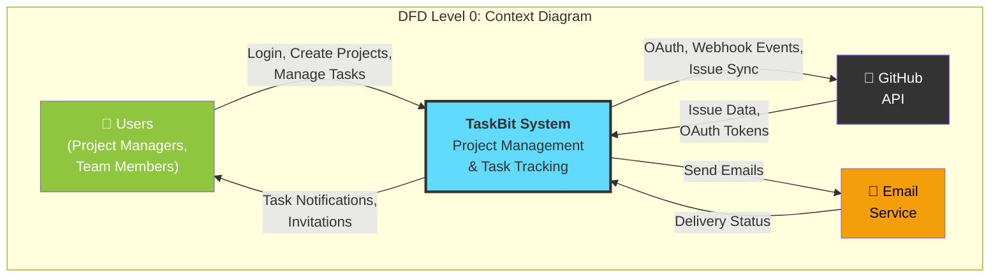
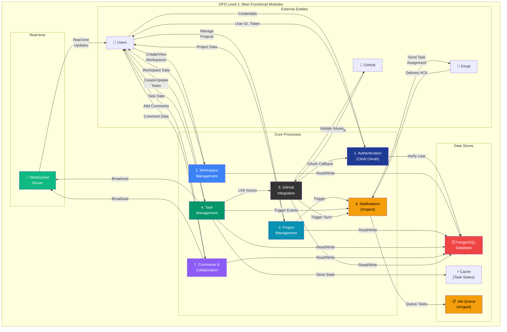

# TaskBit - Data Flow Diagrams (DFD)

## Overview

This document contains Data Flow Diagrams for the TaskBit Project Management System at three levels of abstraction:
- **Level 0 (Context):** High-level overview of system boundaries
- **Level 1 (Functional):** Main processes and data flows
- **Level 2 (Detailed):** Deep dive into GitHub integration workflow

---

## DFD Level 0: Context Diagram

The context diagram shows the TaskBit system as a single entity interacting with external systems and users.

### Level 0 Description

**External Entities:**
- **👤 Users:** Project managers and team members who interact with the system
- **🐙 GitHub:** External GitHub API for OAuth and webhook integration
- **📧 Email Service:** External mail service for sending notifications

**Data Flows:**
1. Users login, create/manage projects and tasks
2. TaskBit sends task notifications and invitations back to users
3. GitHub OAuth for authentication and webhook events for issue synchronization
4. Email service handles notification delivery with status feedback

---

## DFD Level 1: Main Functional Modules

This level breaks down the TaskBit system into its core processes and data stores.

### Level 1 Process Descriptions

| Process | Description | Input | Output |
|---------|-------------|-------|--------|
| **1. Authentication** | Handles user login via Clerk OAuth, token verification | User credentials | JWT token, user ID |
| **2. Workspace Management** | Create and manage organizational workspaces | User actions, workspace data | Workspace entities, member lists |
| **3. Project Management** | Create projects, assign team leads, set status | Project metadata | Project details, team assignments |
| **4. Task Management** | Create tasks, assign to users, track status | Task data, status updates | Task entities, real-time updates |
| **5. GitHub Integration** | OAuth flow, webhook handling, issue sync | GitHub events, OAuth tokens | Issue data, task mappings |
| **6. Notifications** | Background job processing, email triggers | Events from other processes | Notification emails, alert status |
| **7. Comments & Collaboration** | Handle task discussions and threaded comments | Comment data | Comment entities, real-time updates |

### Level 1 Data Stores

| Data Store | Purpose | Contents |
|-----------|---------|----------|
| **PostgreSQL Database** | Primary data persistence | Users, workspaces, projects, tasks, comments, GitHub integrations |
| **Cache** | Fast access to frequently used data | Task states, project progress, user preferences |
| **Job Queue (Inngest)** | Background job management | Pending notifications, email tasks, sync operations |

---

## DFD Level 2: GitHub Integration Detailed Flow

This level provides a detailed breakdown of the complex GitHub integration process, including OAuth flow, webhook handling, and task synchronization.

```mermaid
graph TB
    subgraph "DFD Level 2: GitHub Integration Detailed Flow"
        subgraph "User & Client"
            User["👤 User"]
            Browser["🌐 Browser<br/>(TaskBit UI)"]
        end
        
        subgraph "Frontend Layer"
            OAuth_Init["2.1 OAuth<br/>Initiator"]
            WebhookMonitor["2.2 Webhook<br/>Monitor"]
            RepoSelector["2.3 Repository<br/>Selector"]
        end
        
        subgraph "Backend API Layer"
            AuthHandler["2.4 Auth Flow<br/>Handler"]
            CallbackHandler["2.5 Callback<br/>Handler"]
            WebhookReceiver["2.6 Webhook<br/>Receiver"]
            TokenManager["2.7 Token<br/>Manager"]
        end
        
        subgraph "Data & External"
            GitHub["🐙 GitHub<br/>OAuth Server"]
            GitHubAPI["🐙 GitHub<br/>API"]
            DB["🗄️ Database<br/>(Integration Table)"]
            Queue["📋 Job Queue"]
        end
        
        subgraph "Post-Integration"
            TaskSync["2.8 Task<br/>Sync Engine"]
            NotifEngine["2.9 Notification<br/>Engine"]
        end
        
        User -->|Click Connect| OAuth_Init
        OAuth_Init -->|Generate OAuth URL| Browser
        Browser -->|Redirect to GitHub| GitHub
        
        GitHub -->|Authorization Request| User
        User -->|Grant Permission| GitHub
        
        GitHub -->|Authorization Code| AuthHandler
        AuthHandler -->|Exchange Code| GitHub
        
        GitHub -->|Access Token| CallbackHandler
        CallbackHandler -->|Verify Token| TokenManager
        TokenManager -->|Store Encrypted| DB
        
        TokenManager -->|Return Repos| RepoSelector
        RepoSelector -->|Display List| Browser
        Browser -->|Select Repository| User
        User -->|Confirm| RepoSelector
        
        RepoSelector -->|Create Webhook| WebhookReceiver
        WebhookReceiver -->|POST to GitHub| GitHubAPI
        GitHubAPI -->|Webhook Created| DB
        
        GitHub -->|Issue Event<br/>X-Hub-Signature| WebhookReceiver
        WebhookReceiver -->|Verify Signature| TokenManager
        TokenManager -->|Signature Valid| WebhookReceiver
        
        WebhookReceiver -->|Parse Event| TaskSync
        TaskSync -->|Map Issue State| DB
        TaskSync -->|Issue #45 Closed<br/>→ Task DONE| Queue
        
        Queue -->|Send Email<br/>Notifications| NotifEngine
        NotifEngine -->|Broadcast Update| Browser
        
    end
    
    style OAuth_Init fill:#3b82f6,color:#fff
    style CallbackHandler fill:#3b82f6,color:#fff
    style WebhookReceiver fill:#0891b2,color:#fff
    style AuthHandler fill:#1f3a93,color:#fff
    style TokenManager fill:#059669,color:#fff
    style TaskSync fill:#f59e0b,color:#000
    style NotifEngine fill:#f59e0b,color:#000
    style GitHub fill:#333,color:#fff
    style GitHubAPI fill:#333,color:#fff
    style DB fill:#ef4444,color:#fff
    style Queue fill:#f59e0b,color:#000
```

### Level 2 Process Details

#### Phase 1: OAuth Authorization
- **2.1 OAuth Initiator:** User clicks "Connect GitHub" button
- **2.4 Auth Flow Handler:** Generates OAuth URL with state token for CSRF protection
- **GitHub OAuth Server:** User authenticates and grants permissions

#### Phase 2: Token Exchange & Storage
- **2.5 Callback Handler:** Receives authorization code from GitHub
- **2.7 Token Manager:** Exchanges code for access token
- **Database:** Stores encrypted access token for future API calls

#### Phase 3: Repository Selection
- **2.3 Repository Selector:** Fetches user's repositories from GitHub API
- **Browser:** Displays repository list for user selection
- **Webhook Creation:** Sets up webhook for selected repository

#### Phase 4: Webhook Event Processing
- **2.6 Webhook Receiver:** Receives GitHub issue events (opened, closed, edited)
- **Token Manager:** Verifies HMAC-SHA256 signature for security
- **2.8 Task Sync Engine:** Maps GitHub issue states to TaskBit task statuses
  - GitHub `closed` → TaskBit `DONE`
  - GitHub `open` → TaskBit `IN_PROGRESS`

#### Phase 5: Notification
- **Job Queue:** Queues notification tasks
- **2.9 Notification Engine:** Sends email notifications and broadcasts real-time updates

### Level 2 Data Flow Summary

| Flow | From | To | Data |
|------|------|----|----|
| OAuth Request | User | GitHub | Authorization scope |
| OAuth Response | GitHub | Backend | Authorization code |
| Token Exchange | Backend | GitHub | Code + Client Secret |
| Access Token | GitHub | Backend | JWT Token |
| Repository List | GitHub API | Frontend | Repo names, URLs |
| Webhook Event | GitHub | Backend | Issue event payload |
| Signature | GitHub | Backend | X-Hub-Signature-256 header |
| Task Update | Backend | Database | Issue state mapping |
| Notification | Backend | Email | Task assignment alert |

---

## Key Features & Data Flows

### Real-time Updates
- WebSocket connection maintains live sync between clients
- Task updates broadcast to all connected users in project
- Comments appear instantly without page refresh

### Event-Driven Architecture
- Task updates trigger Inngest events
- Events queued for background processing
- Email notifications sent asynchronously
- GitHub integration synced through webhooks

### Multi-Tenant Isolation
- Workspace-level data isolation
- User access verified before database queries
- Role-based permission checks
- Cross-workspace data access prevented

---

## Technology Stack Integration

| Layer | Technology | DFD Reference |
|-------|-----------|---|
| Frontend | React 19 + Vite | Browser, OAuth Initiator |
| Real-time | WebSocket (ws 8.20) | WebSocket Server |
| API | Express.js 5.1 | Backend handlers |
| Database | PostgreSQL (Neon) | Database store |
| ORM | Prisma 6.17 | Data access layer |
| Auth | Clerk OAuth | Authentication process |
| Background Jobs | Inngest | Job Queue, Notification Engine |
| External APIs | GitHub API | GitHub integration |
| Email | Nodemailer | Email Service |

---

## Security Considerations

1. **OAuth Security:** State token CSRF protection, secure code exchange
2. **Webhook Verification:** HMAC-SHA256 signature verification
3. **Token Management:** Encrypted storage of GitHub access tokens
4. **Data Isolation:** Multi-tenant workspace boundaries enforced
5. **Access Control:** Role-based permission checks at each process

---

**Document Generated:** April 25, 2026  
**System:** TaskBit Project Management Platform  
**Version:** 1.0

