# Data Flow Diagrams (DFDs) - TaskBit Project

## DFD Level 0 (Context Diagram)

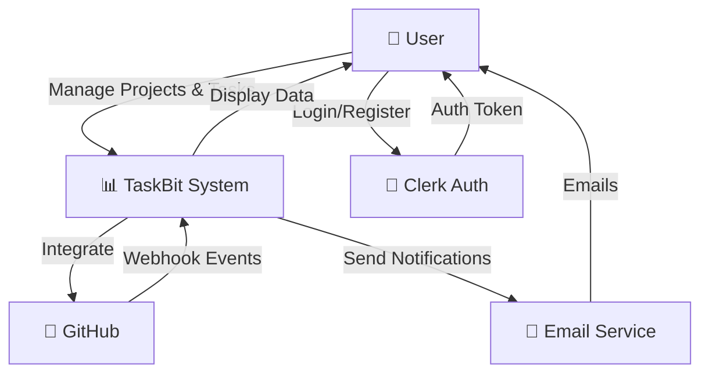

---

## DFD Level 1 (Main Processes & Data Stores)

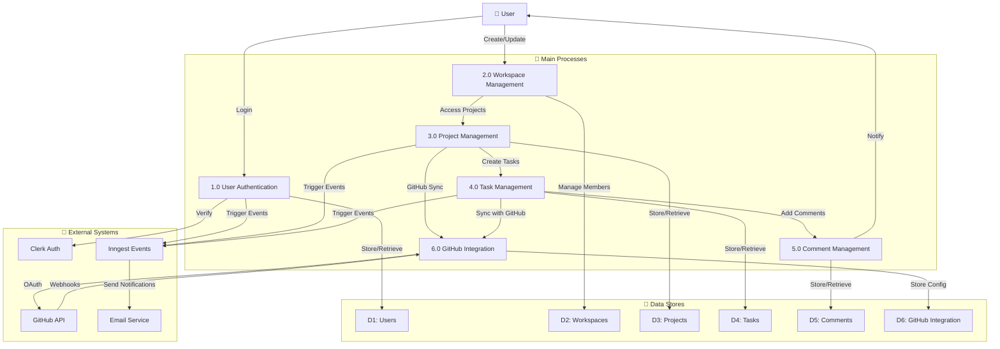

---

## DFD Level 2 - User Authentication & Profile (Process 1.0)

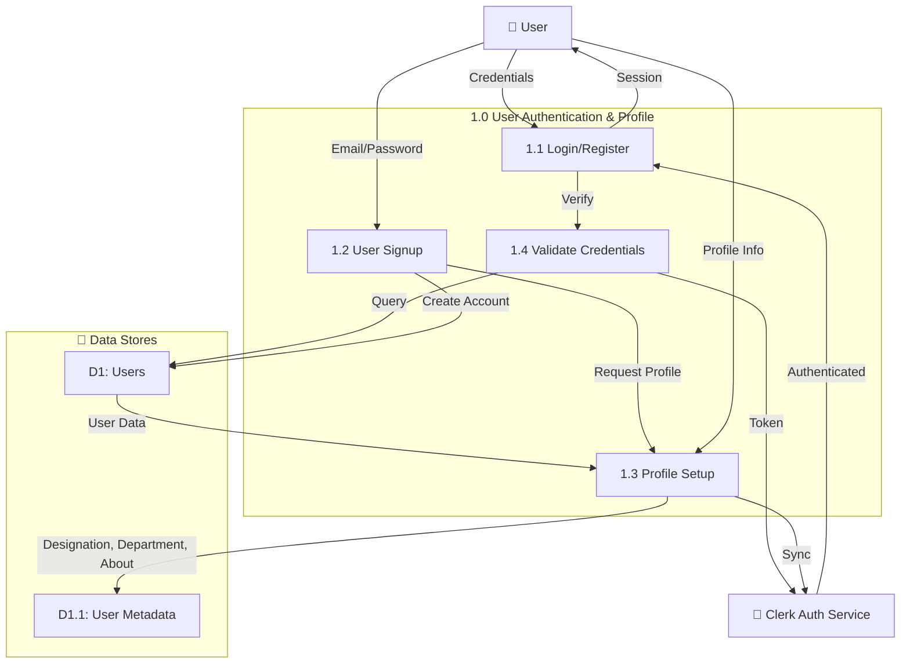

---

## DFD Level 2 - Workspace Management (Process 2.0)

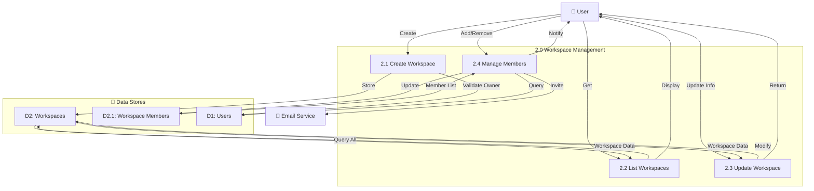

---

## DFD Level 2 - Project Management (Process 3.0)

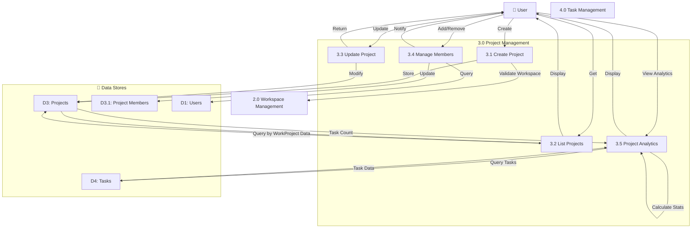

---

## DFD Level 2 - Task Management (Process 4.0)

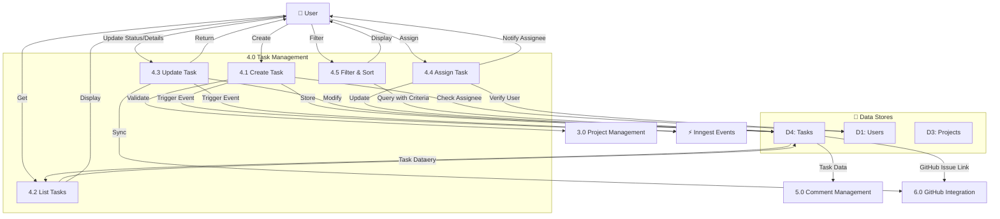

---

## DFD Level 2 - Comment Management (Process 5.0)

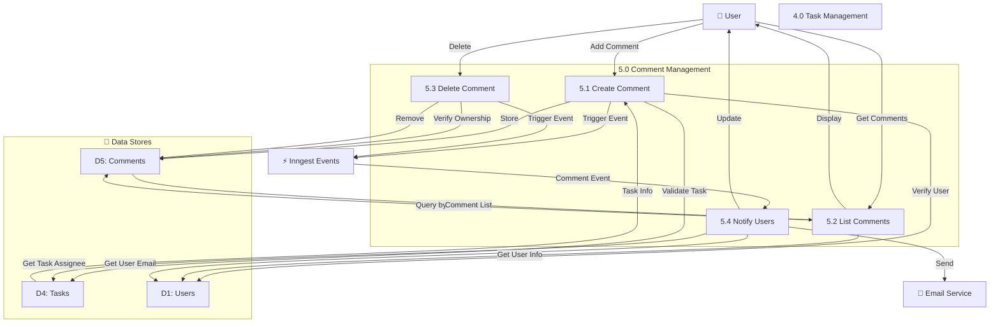

---

## DFD Level 2 - GitHub Integration (Process 6.0)

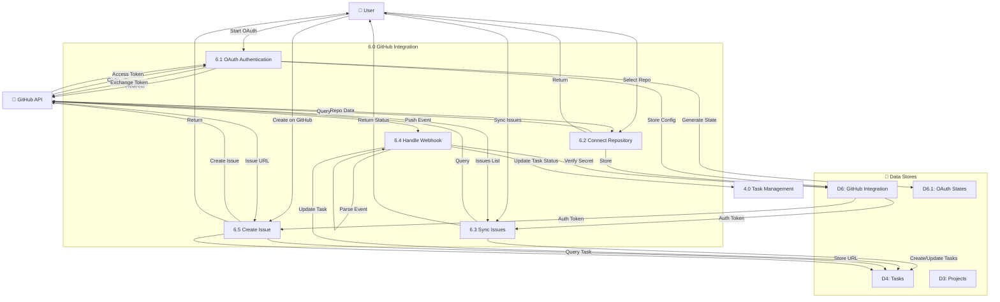

---

## DFD Level 3 - Create Task (Detailed - Process 4.1)

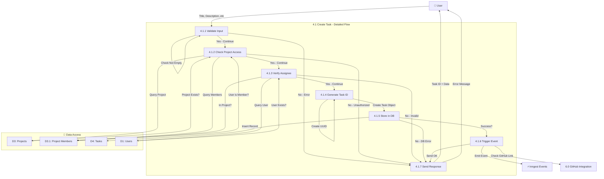

---

## DFD Level 3 - Update Task Status (Detailed - Process 4.3)

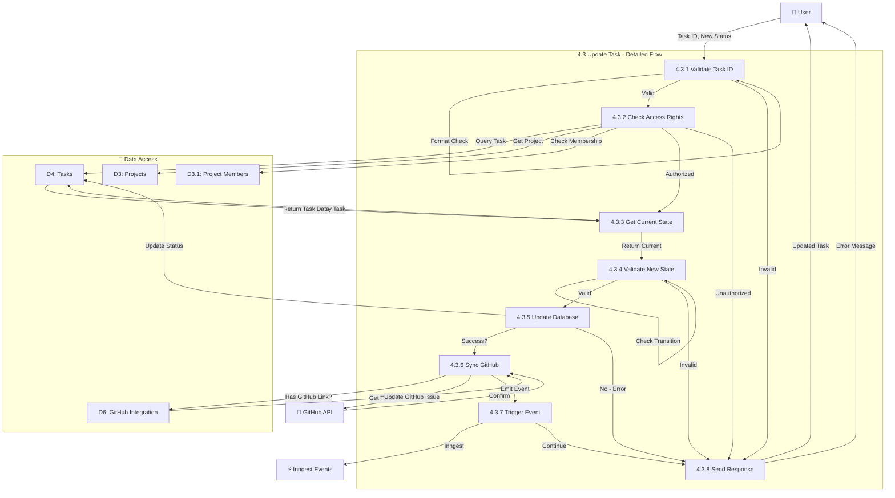

---

## DFD Level 3 - GitHub Webhook Processing (Detailed - Process 6.4)

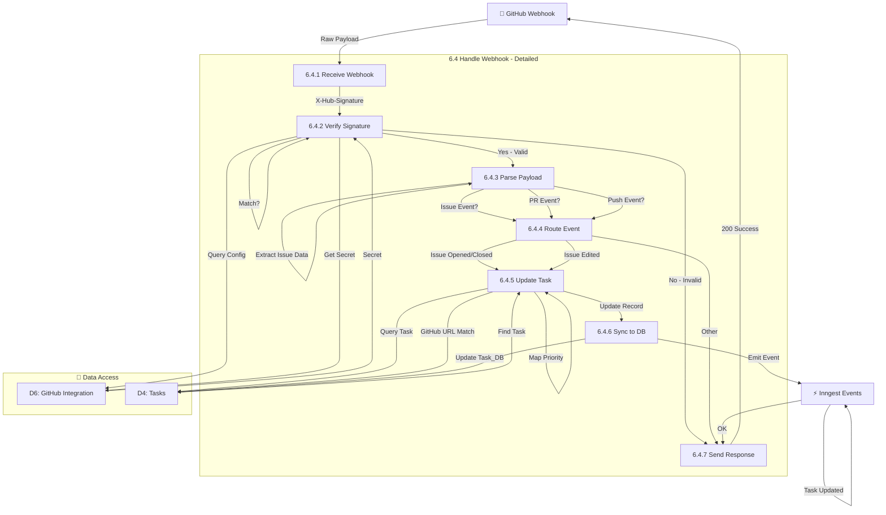

---

## DFD Legend

| Symbol | Meaning |
|--------|---------|
| Rounded Box | External System or User |
| Rectangle | Process |
| Cylinder | Data Store |
| Arrow | Data Flow |
| D1, D2, etc | Data Store Reference |

## Key Entities

### Processes
- **1.0**: User Authentication & Profile
- **2.0**: Workspace Management
- **3.0**: Project Management
- **4.0**: Task Management
- **5.0**: Comment Management
- **6.0**: GitHub Integration

### Data Stores
- **D1**: Users (with profile metadata)
- **D2**: Workspaces
- **D3**: Projects & Project Members
- **D4**: Tasks
- **D5**: Comments
- **D6**: GitHub Integration & OAuth States

### External Systems
- **Clerk**: Authentication service
- **GitHub**: Issue tracking & webhooks
- **Inngest**: Event processing
- **Email**: Notification service
- **PostgreSQL**: Main database

## Data Flows Summary

1. **Authentication Flow**: User → Clerk → System
2. **Workspace Flow**: User → Create/Manage Workspaces → Members
3. **Project Flow**: Workspace → Projects → Members → Tasks
4. **Task Flow**: Create → Assign → Update Status → GitHub Sync
5. **Comment Flow**: Task → Comments → Notifications
6. **GitHub Flow**: OAuth → Connect → Webhook Events → Task Updates
