# TaskBit - Simplified DFD Diagrams

## Level 0: Context Diagram

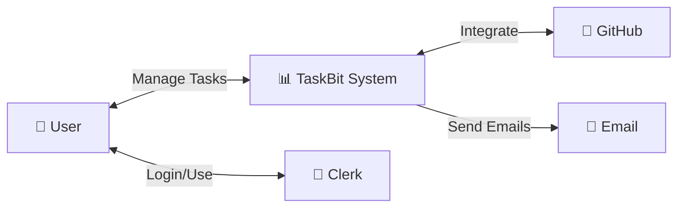

---

## Level 1: Main Processes

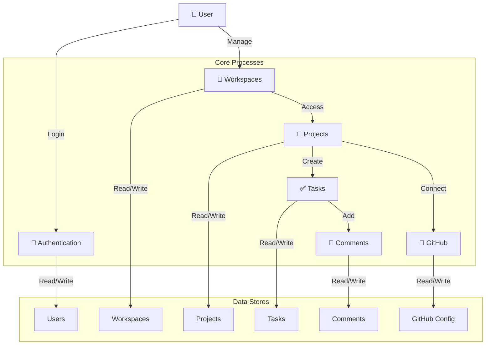

---

## Level 2: Authentication Process (1.0)

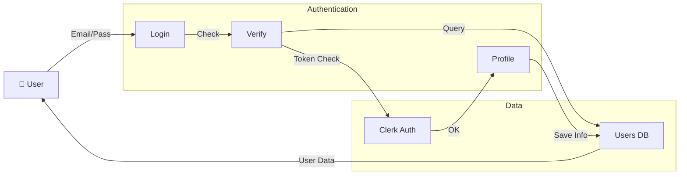

---

## Level 2: Workspace Process (2.0)

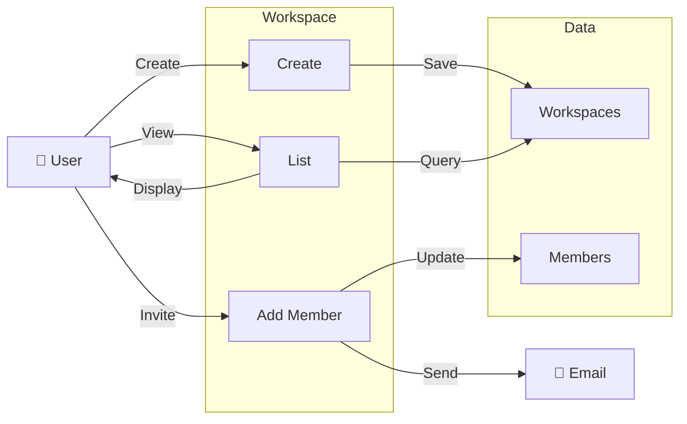

---

## Level 2: Project Process (3.0)

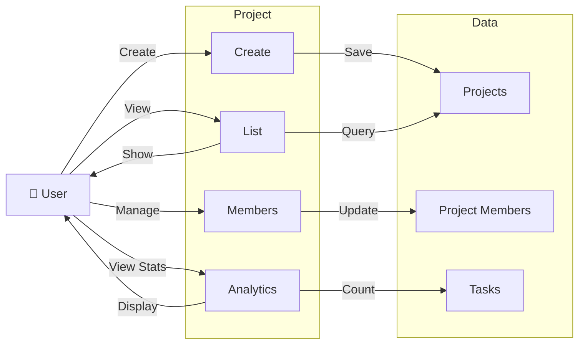

---

## Level 2: Task Process (4.0)

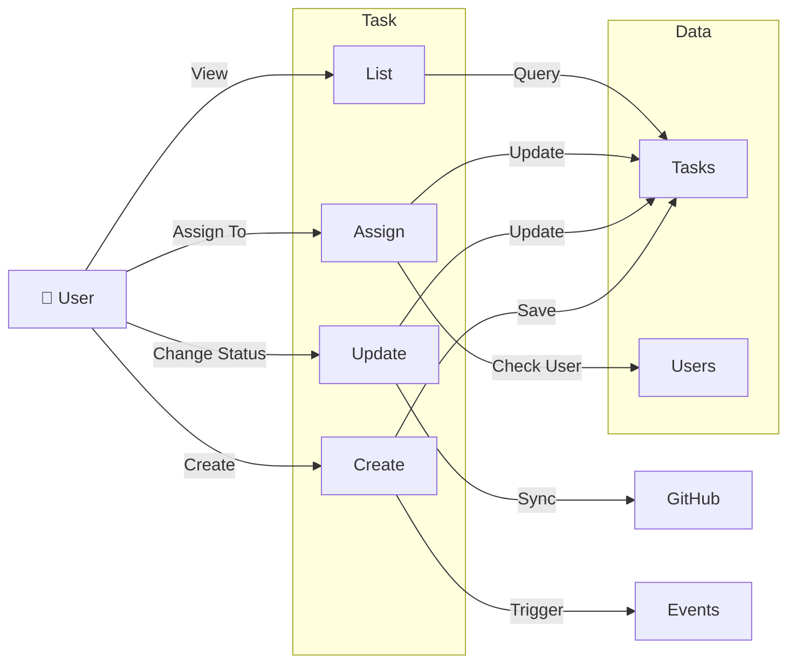

---

## Level 2: Comment Process (5.0)

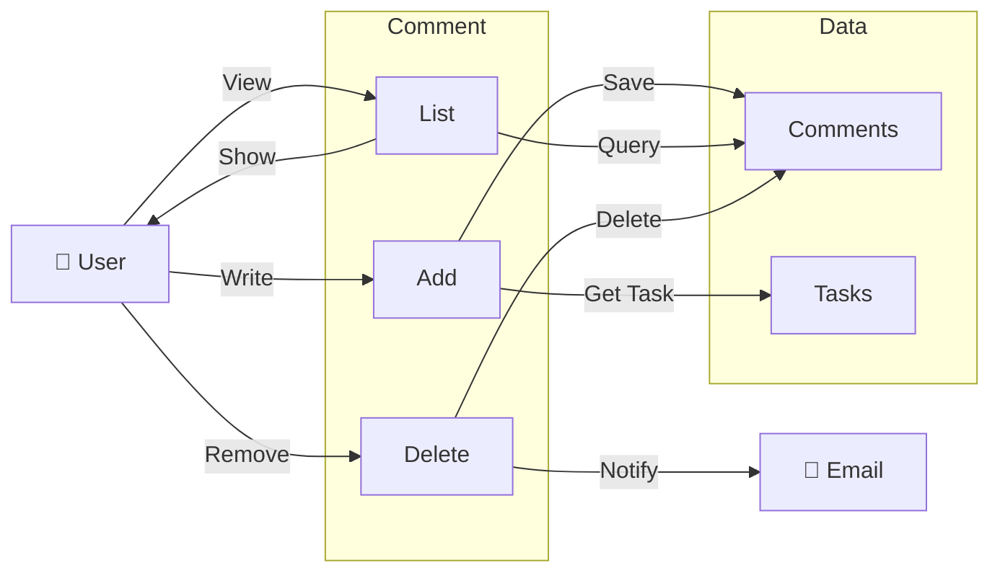

---

## Level 2: GitHub Integration (6.0)

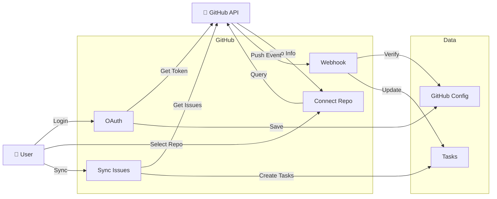

---

## Level 3: Create Task Detailed (4.1)

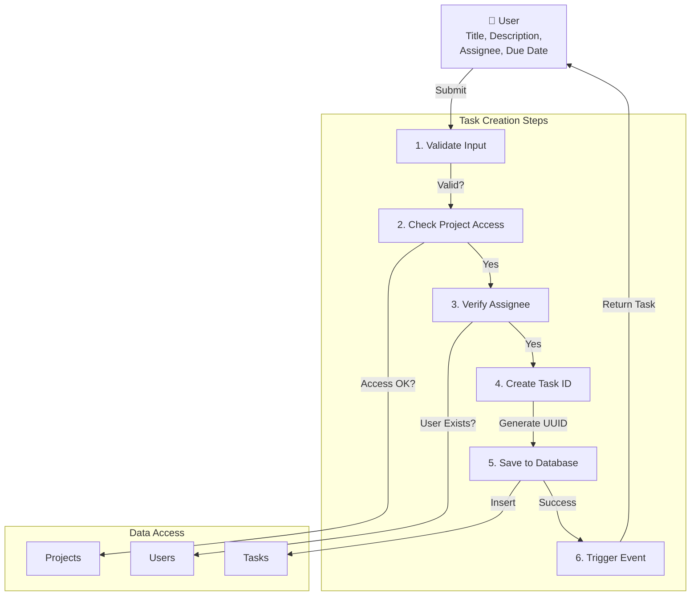

---

## Level 3: Update Task Status Detailed (4.3)

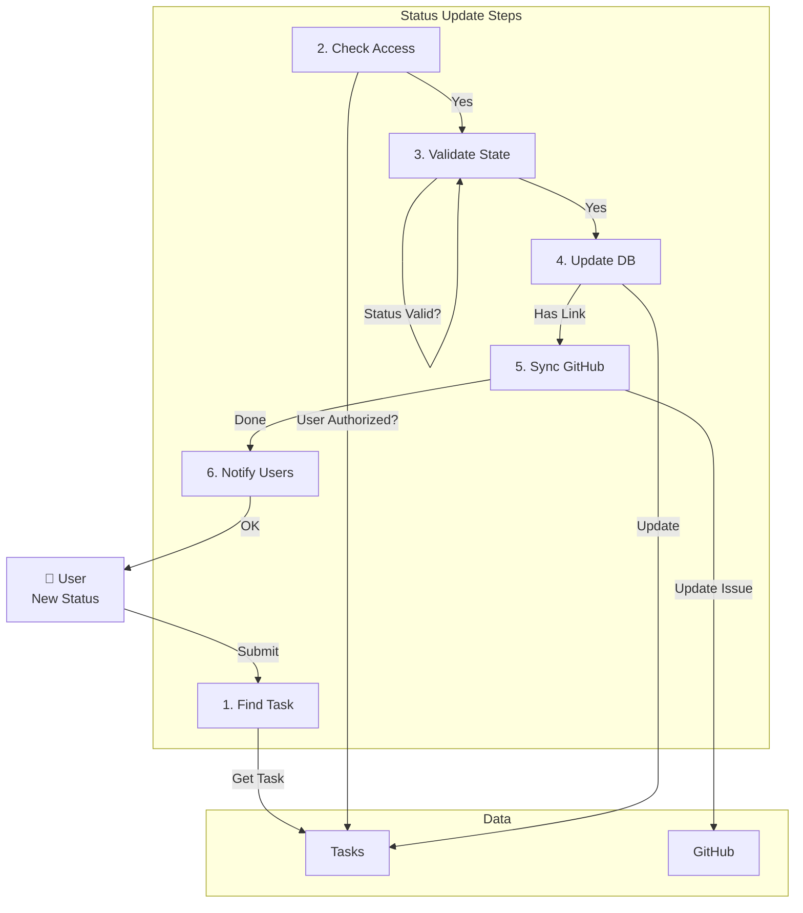

---

## Level 3: GitHub Webhook Processing (6.4)

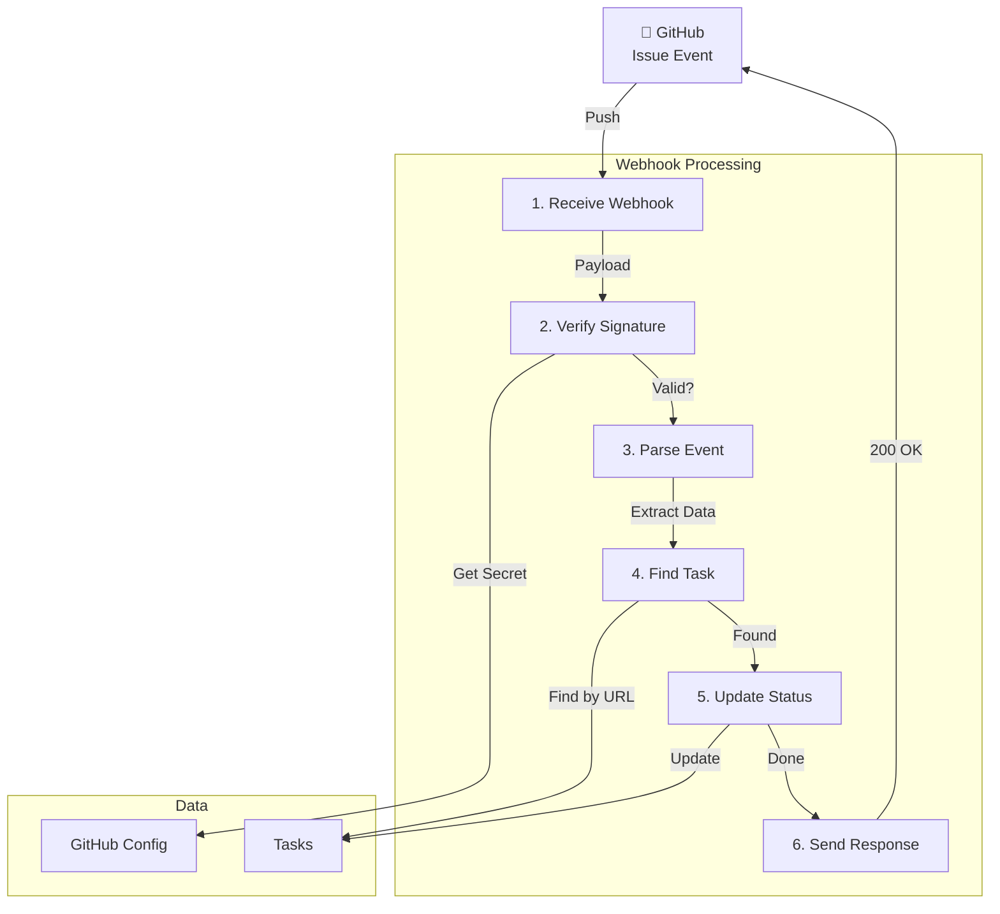

---

## Data Flow: User Creates Task

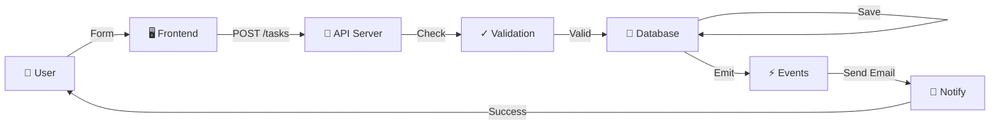

---

## Data Flow: GitHub Updates Task

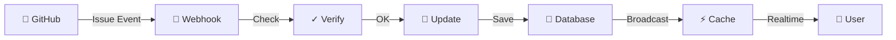

---

## Complete System Flow

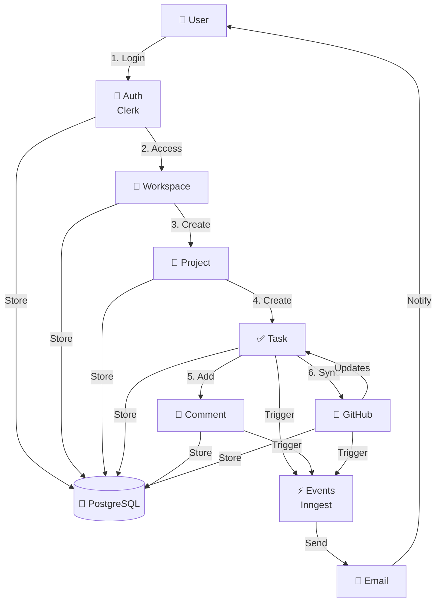

---

## Entity Relationships

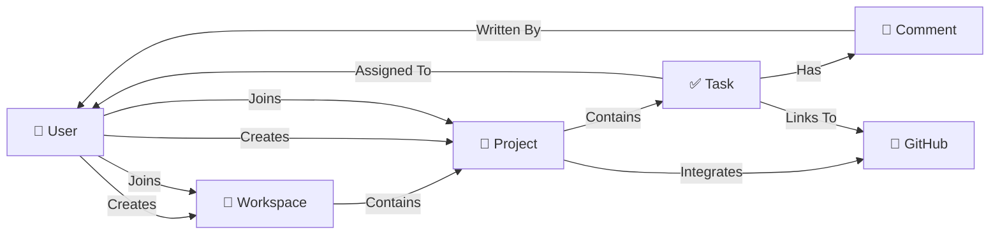

---

## Legend

```
🔐 = Authentication
🏢 = Workspace Management
📁 = Project Management
✅ = Task Management
💬 = Comments
🐙 = GitHub Integration
💾 = Database
⚡ = Events/Async Processing
📧 = Email/Notification
🖥️ = Frontend
🔌 = API
✓ = Validation
```
