## 1. System Architecture Diagram

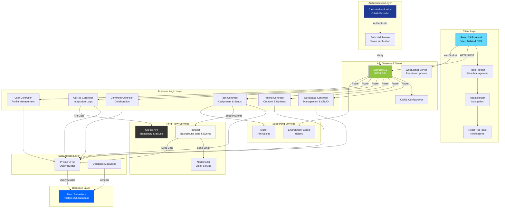

---

## 2. Entity Relationship Diagram (ERD)

```mermaid
erDiagram
    USER ||--o{ WORKSPACE : "owns"
    USER ||--o{ WORKSPACEMEMBER : "joins"
    WORKSPACE ||--o{ WORKSPACEMEMBER : "contains"
    WORKSPACE ||--o{ PROJECT : "contains"
    USER ||--o{ PROJECT : "leads"
    USER ||--o{ PROJECTMEMBER : "joins"
    PROJECT ||--o{ PROJECTMEMBER : "contains"
    PROJECT ||--o{ TASK : "contains"
    USER ||--o{ TASK : "assigns"
    USER ||--o{ COMMENT : "writes"
    TASK ||--o{ COMMENT : "has"
    PROJECT ||--o| PROJECTGITHUBINTEGRATION : "has"
    PROJECTGITHUBINTEGRATION ||--o{ GITHUBOAUTHSTATE : "generates"

    USER {
        string id PK
        string name
        string email UK
        string image
        string designation
        string department
        string about
        datetime createdAt
        datetime updatedAt
    }

    WORKSPACE {
        string id PK
        string name
        string slug UK
        string description
        json settings
        string ownerId FK
        string image_url
        datetime createdAt
        datetime updatedAt
    }

    WORKSPACEMEMBER {
        string id PK
        string userId FK
        string workspaceId FK
        string message
        enum role "ADMIN, MEMBER"
        unique "userId, workspaceId"
    }

    PROJECT {
        string id PK
        string name
        string description
        enum priority "LOW, MEDIUM, HIGH"
        enum status "ACTIVE, PLANNING, COMPLETED, ON_HOLD, CANCELLED"
        datetime start_date
        datetime end_date
        string team_lead FK
        string workspaceId FK
        int progress
        datetime createdAt
        datetime updatedAt
    }

    PROJECTMEMBER {
        string id PK
        string userId FK
        string projectId FK
        unique "userId, projectId"
    }

    TASK {
        string id PK
        string projectId FK
        string title
        string description
        enum status "TODO, IN_PROGRESS, DONE"
        enum type "TASK, BUG, FEATURE, IMPROVEMENT, OTHER"
        enum priority "LOW, MEDIUM, HIGH"
        string assigneeId FK
        datetime due_date
        int githubIssueNumber
        string githubIssueUrl
        string githubRepository
        datetime createdAt
        datetime updatedAt
    }

    COMMENT {
        string id PK
        string content
        string userId FK
        string taskId FK
        datetime createdAt
    }

    PROJECTGITHUBINTEGRATION {
        string id PK
        string projectId FK UK
        string githubAccountLogin
        string githubUserId
        string repository
        string accessToken
        string webhookSecret
        datetime webhookSecretUpdatedAt
        datetime createdAt
        datetime updatedAt
    }

    GITHUBOAUTHSTATE {
        string id PK
        string state UK
        string userId
        string projectId
        string integrationId FK
        datetime expiresAt
        datetime createdAt
    }
```

---

## 3. Data Flow Diagram - Level 0 (Context)

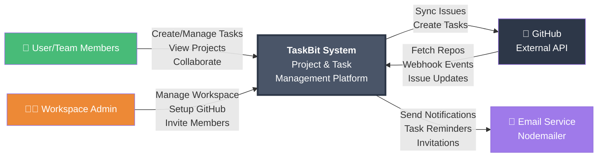

---

## 4. Data Flow Diagram - Level 1 (Functional)

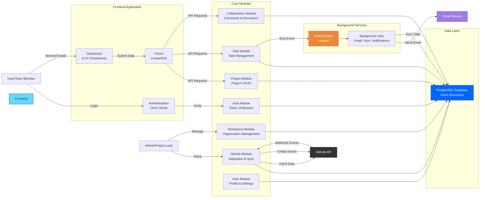

---

## 5. Data Flow Diagram - Level 2 (Detailed: GitHub Integration + Project Management)

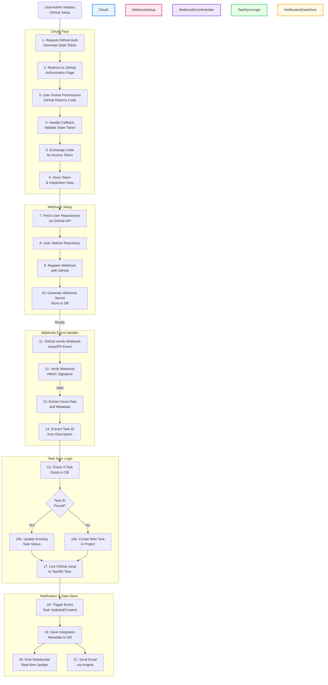

---


# TaskBit - Architecture Diagrams in Mermaid Format

## 1. Overall System Architecture


---

## 2. Three-Tier Client-Server Architecture

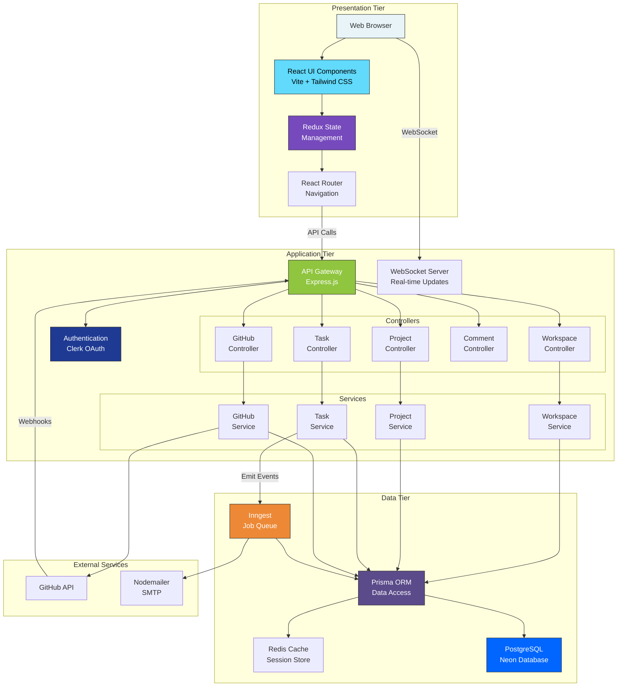

---

## 3. Component Hierarchy & Data Flow

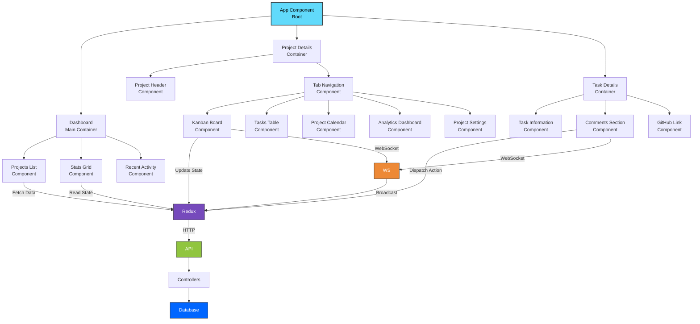

---

## 4. Data Model Relationships

```mermaid
erDiagram
    USER ||--o{ WORKSPACE : "owns"
    USER ||--o{ WORKSPACEMEMBER : "joins"
    WORKSPACE ||--o{ WORKSPACEMEMBER : "contains"
    WORKSPACE ||--o{ PROJECT : "contains"
    USER ||--o{ PROJECT : "leads"
    USER ||--o{ PROJECTMEMBER : "joins"
    PROJECT ||--o{ PROJECTMEMBER : "contains"
    PROJECT ||--o{ TASK : "contains"
    USER ||--o{ TASK : "assigns"
    USER ||--o{ COMMENT : "writes"
    TASK ||--o{ COMMENT : "has"
    PROJECT ||--o| PROJECTGITHUBINTEGRATION : "has"
    PROJECTGITHUBINTEGRATION ||--o{ GITHUBOAUTHSTATE : "generates"

    USER {
        string id PK
        string name
        string email UK
        string image
        string designation
        string department
        string about
        datetime createdAt
        datetime updatedAt
    }

    WORKSPACE {
        string id PK
        string name
        string slug UK
        string description
        json settings
        string ownerId FK
        string image_url
        datetime createdAt
        datetime updatedAt
    }

    WORKSPACEMEMBER {
        string id PK
        string userId FK
        string workspaceId FK
        string message
        enum role "ADMIN, MEMBER"
    }

    PROJECT {
        string id PK
        string name
        string description
        enum priority "LOW, MEDIUM, HIGH"
        enum status "ACTIVE, PLANNING, COMPLETED, ON_HOLD, CANCELLED"
        datetime start_date
        datetime end_date
        string team_lead FK
        string workspaceId FK
        int progress
        datetime createdAt
        datetime updatedAt
    }

    PROJECTMEMBER {
        string id PK
        string userId FK
        string projectId FK
    }

    TASK {
        string id PK
        string projectId FK
        string title
        string description
        enum status "TODO, IN_PROGRESS, DONE"
        enum type "TASK, BUG, FEATURE, IMPROVEMENT, OTHER"
        enum priority "LOW, MEDIUM, HIGH"
        string assigneeId FK
        datetime due_date
        int githubIssueNumber
        string githubIssueUrl
        string githubRepository
        datetime createdAt
        datetime updatedAt
    }

    COMMENT {
        string id PK
        string content
        string userId FK
        string taskId FK
        datetime createdAt
    }

    PROJECTGITHUBINTEGRATION {
        string id PK
        string projectId FK UK
        string githubAccountLogin
        string githubUserId
        string repository
        string accessToken
        string webhookSecret
        datetime webhookSecretUpdatedAt
        datetime createdAt
        datetime updatedAt
    }

    GITHUBOAUTHSTATE {
        string id PK
        string state UK
        string userId
        string projectId
        string integrationId FK
        datetime expiresAt
        datetime createdAt
    }
```

---

## 5. Request-Response Flow

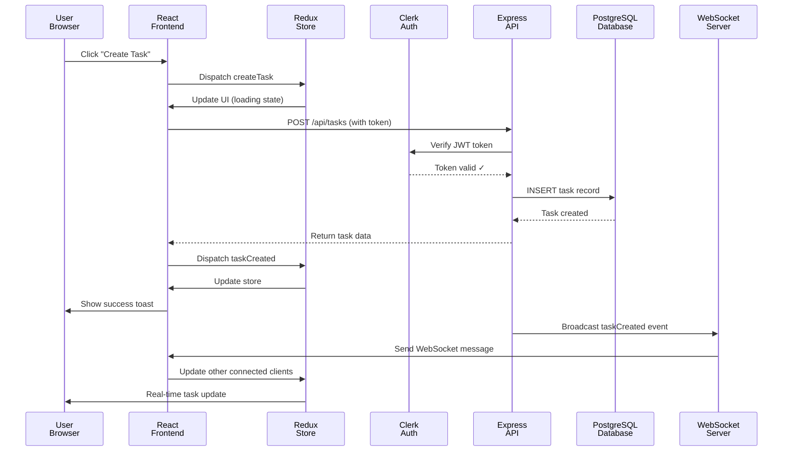

---

## 6. GitHub Integration Flow

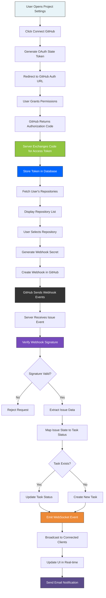

---

## 7. Real-time Update Architecture

```mermaid
graph LR
    subgraph "User 1 Session"
        U1["User 1<br/>Browser"]
        WS1["WebSocket<br/>Connection"]
    end

    subgraph "User 2 Session"
        U2["User 2<br/>Browser"]
        WS2["WebSocket<br/>Connection"]
    end

    subgraph "Server"
        Server["Express Server"]
        WSServer["WebSocket<br/>Server"]
        Redux["Redux Store"]
        DB["Database"]
    end

    U1 -->|Update Task Status| Redux
    Redux -->|Save to DB| DB
    Redux -->|Broadcast Event| WSServer
    
    WSServer -->|Send Update| WS1
    WSServer -->|Send Update| WS2
    
    WS1 -->|WebSocket Event| U1
    WS2 -->|WebSocket Event| U2
    
    U1 -->|Refresh UI| U1
    U2 -->|Refresh UI| U2

    style U1 fill:#61dafb,color:#000,stroke:#333
    style U2 fill:#61dafb,color:#000,stroke:#333
    style WSServer fill:#ed8936,color:#fff,stroke:#333
    style Redux fill:#764abc,color:#fff,stroke:#333
    style DB fill:#0066ff,color:#fff,stroke:#333
```

---

## 8. Authentication Flow

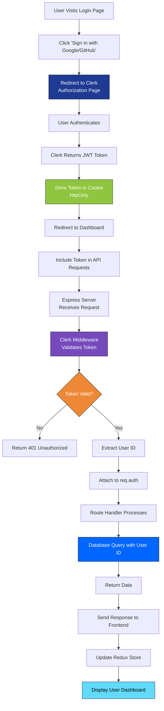

---

## 9. Background Job Processing

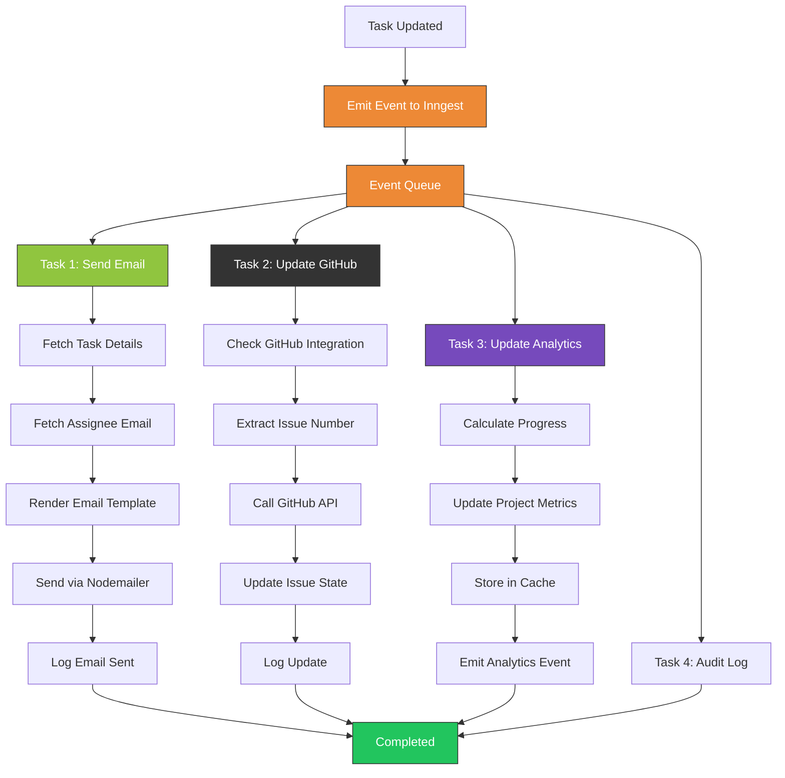

---

## 10. Deployment Architecture

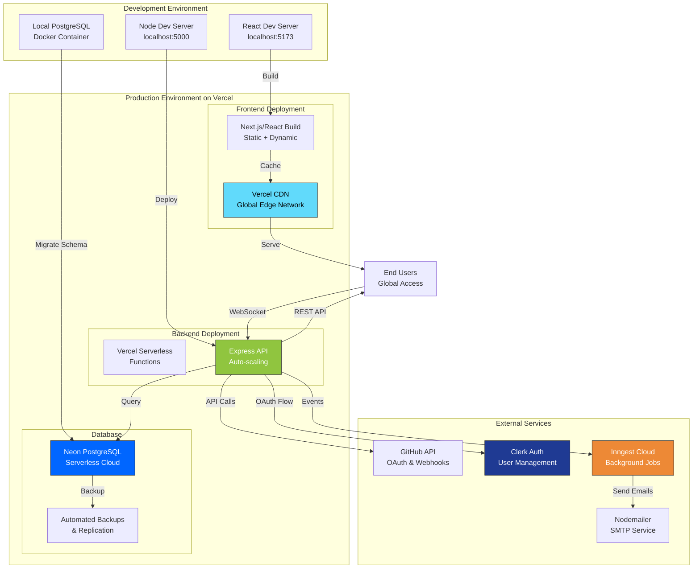

---

## 11. Microservices-Style Module Architecture

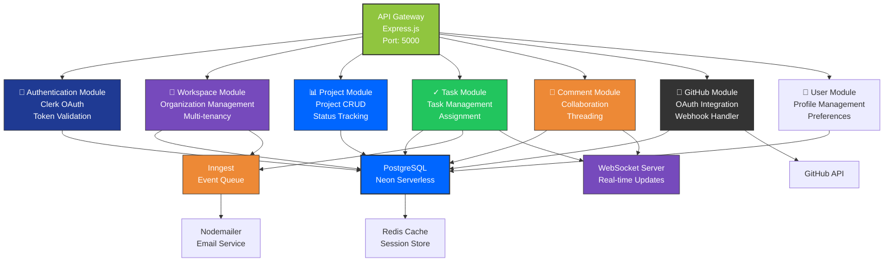

---

## 12. Error Handling & Recovery Flow

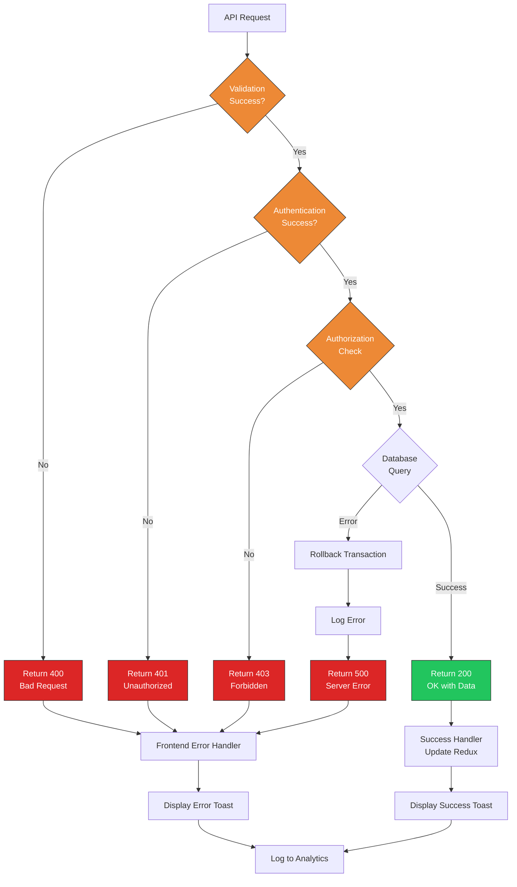

---


mermaid

## 1. USE CASE DIAGRAM

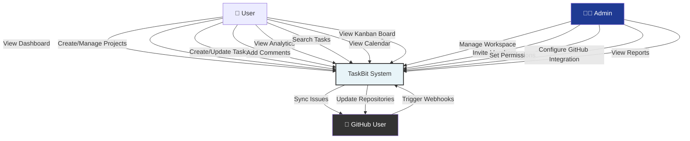

---

## 2. COMPONENT DIAGRAM

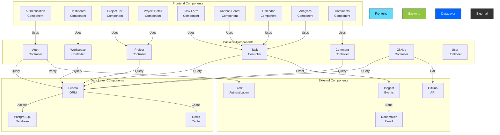

---

## 3. DEPLOYMENT DIAGRAM

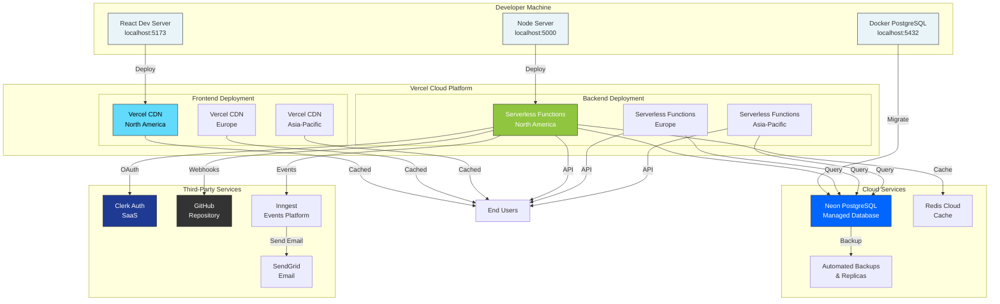

---

## 4. SEQUENCE DIAGRAM - USER LOGIN

```mermaid
sequenceDiagram
    participant User as User<br/>Browser
    participant Frontend as React<br/>Frontend
    participant Clerk as Clerk<br/>Service
    participant API as Express<br/>API
    participant DB as PostgreSQL<br/>Database
    participant Redux as Redux<br/>Store

    User->>Frontend: Click "Sign In"
    Frontend->>Clerk: Initiate OAuth
    Clerk->>User: Show Auth Page
    User->>Clerk: Enter Credentials
    Clerk->>Clerk: Validate Credentials
    Clerk->>Frontend: Return JWT Token
    Frontend->>Frontend: Store Token (httpOnly)
    Frontend->>API: GET /api/workspaces (with token)
    API->>API: Verify Token with Clerk
    API->>DB: Query user workspaces
    DB-->>API: Return workspaces + projects
    API-->>Frontend: Return data (JSON)
    Frontend->>Redux: Dispatch setWorkspaces
    Redux-->>Frontend: Update store
    Frontend->>User: Render Dashboard
    User->>User: View Projects
```

---

## 5. SEQUENCE DIAGRAM - CREATE TASK

```mermaid
sequenceDiagram
    participant User as User
    participant Frontend as React<br/>Frontend
    participant Redux as Redux
    participant API as Express<br/>API
    participant DB as PostgreSQL
    participant WS as WebSocket<br/>Server
    participant Inngest as Inngest<br/>Queue
    participant Email as Email<br/>Service

    User->>Frontend: Fill Task Form
    User->>Frontend: Click "Create"
    Frontend->>Redux: Dispatch createTaskAsync
    Redux->>Frontend: Set loading = true
    Frontend->>API: POST /api/tasks
    API->>DB: INSERT task record
    DB-->>API: Task created
    API-->>Frontend: Return task data
    Frontend->>Redux: Dispatch taskCreated
    Redux->>Frontend: Add to store
    Frontend->>User: Show success toast
    API->>WS: Broadcast taskCreated
    WS->>Frontend: Send WebSocket event
    Frontend->>Redux: Update store (real-time)
    API->>Inngest: Emit taskAssigned event
    Inngest->>DB: Update task metadata
    Inngest->>Email: Send notification
    Email->>Email: Queue email
```

---

## 6. SEQUENCE DIAGRAM - GITHUB WEBHOOK

```mermaid
sequenceDiagram
    participant GH as GitHub<br/>Repository
    participant WebHook as Webhook<br/>Endpoint
    participant API as Express<br/>API
    participant Verify as Signature<br/>Verification
    participant DB as PostgreSQL
    participant WS as WebSocket
    participant Inngest as Inngest

    GH->>WebHook: POST issue.opened event
    WebHook->>Verify: Verify HMAC signature
    Verify->>Verify: Calculate HMAC-SHA256
    Verify-->>WebHook: Signature valid ✓
    WebHook->>API: Extract issue data
    API->>DB: Find linked task
    alt Task exists
        API->>DB: Update task status
    else Task not found
        API->>DB: Create new task from issue
    end
    DB-->>API: Task saved
    API->>WS: Broadcast update
    WS->>API: Emit to clients
    API->>Inngest: Emit taskUpdated event
    Inngest->>Inngest: Process background jobs
```

---

## 7. CLASS DIAGRAM

```mermaid
classDiagram
    class User {
        -id: String
        -name: String
        -email: String
        -image: String
        -designation: String
        -department: String
        +getWorkspaces()
        +getAssignedTasks()
        +updateProfile()
    }

    class Workspace {
        -id: String
        -name: String
        -slug: String
        -description: String
        -settings: JSON
        -ownerId: String
        +addMember()
        +removeMember()
        +getProjects()
        +getMembers()
    }

    class Project {
        -id: String
        -name: String
        -description: String
        -status: String
        -priority: String
        -startDate: DateTime
        -endDate: DateTime
        -progress: Integer
        +addTask()
        +removeTask()
        +getTasks()
        +getMembers()
        +updateProgress()
    }

    class Task {
        -id: String
        -title: String
        -description: String
        -status: String
        -priority: String
        -type: String
        -dueDate: DateTime
        -assigneeId: String
        -githubIssueNumber: Integer
        +updateStatus()
        +assignTo()
        +addComment()
        +linkGitHubIssue()
    }

    class Comment {
        -id: String
        -content: String
        -userId: String
        -taskId: String
        -createdAt: DateTime
        +updateContent()
        +delete()
    }

    class ProjectGitHubIntegration {
        -id: String
        -projectId: String
        -repository: String
        -accessToken: String
        -webhookSecret: String
        +generateWebhookSecret()
        +verifyWebhookSignature()
        +createWebhook()
        +disconnect()
    }

    class WorkspaceMember {
        -id: String
        -userId: String
        -workspaceId: String
        -role: String
        +updateRole()
        +remove()
    }

    class ProjectMember {
        -id: String
        -userId: String
        -projectId: String
        +remove()
    }

    User "1" -- "*" Workspace : owns
    User "1" -- "*" WorkspaceMember : joins
    Workspace "1" -- "*" WorkspaceMember : contains
    Workspace "1" -- "*" Project : contains
    User "1" -- "*" Project : leads
    User "1" -- "*" ProjectMember : joins
    Project "1" -- "*" ProjectMember : contains
    Project "1" -- "*" Task : contains
    User "1" -- "*" Task : assigns
    User "1" -- "*" Comment : writes
    Task "1" -- "*" Comment : has
    Project "1" -- "0..1" ProjectGitHubIntegration : has
```

---

## 8. STATE DIAGRAM - TASK LIFECYCLE

```mermaid
stateDiagram-v2
    [*] --> TODO
    
    TODO --> IN_PROGRESS: assign_task / notify_assignee
    TODO --> DONE: mark_complete / if urgent
    
    IN_PROGRESS --> TODO: revert / reassign
    IN_PROGRESS --> DONE: complete_task / update_github
    
    DONE --> IN_PROGRESS: reopen / needs_rework
    
    DONE --> [*]: archive

    note right of TODO
        Initial state
        No assignee
        Ready to start
    end note

    note right of IN_PROGRESS
        Active work
        Assigned to user
        Can have subtasks
    end note

    note right of DONE
        Completed work
        Can be archived
        Links to GitHub issue
    end note
```

---

## 9. STATE DIAGRAM - PROJECT LIFECYCLE

```mermaid
stateDiagram-v2
    [*] --> PLANNING
    
    PLANNING --> ACTIVE: start_project / notify_team
    PLANNING --> CANCELLED: cancel / archive_tasks
    
    ACTIVE --> ON_HOLD: pause_project / notify_stakeholders
    ACTIVE --> COMPLETED: finish_project / generate_report
    ACTIVE --> CANCELLED: cancel / refund_resources
    
    ON_HOLD --> ACTIVE: resume_project / restart_timeline
    ON_HOLD --> CANCELLED: cancel / cleanup
    
    COMPLETED --> [*]: archive
    CANCELLED --> [*]: archive

    note right of PLANNING
        Initial phase
        Setting up team
        Creating tasks
    end note

    note right of ACTIVE
        In progress
        Tasks being completed
        Team working
    end note

    note right of ON_HOLD
        Temporarily paused
        Can resume later
        Resources preserved
    end note
```

---

## 10. ACTIVITY DIAGRAM - CREATE PROJECT WORKFLOW

```mermaid
graph TD
    Start([User Initiates Project Creation]) --> Form["Display Project Form"]
    Form --> Input["User Enters:<br/>Name, Description,<br/>Dates, Priority"]
    Input --> Validate{Valid<br/>Input?}
    
    Validate -->|No| Error["Show Validation<br/>Errors"]
    Error --> Input
    
    Validate -->|Yes| CheckAuth{User<br/>Authorized?}
    CheckAuth -->|No| Denied["Show Permission<br/>Error"]
    Denied --> End1([End])
    
    CheckAuth -->|Yes| Create["Create Project<br/>in Database"]
    Create --> AddLead["Add Team Lead"]
    AddLead --> Notify["Send Notifications<br/>to Team"]
    Notify --> Webhook["Trigger Inngest<br/>Event"]
    Webhook --> Cache["Update Cache"]
    Cache --> Broadcast["Broadcast WebSocket<br/>Update"]
    Broadcast --> Success["Show Success<br/>Message"]
    Success --> Redirect["Redirect to<br/>Project Page"]
    Redirect --> End2([End])

    style Start fill:#22c55e,color:#fff
    style Validate fill:#ed8936,color:#fff
    style CheckAuth fill:#ed8936,color:#fff
    style Create fill:#0066ff,color:#fff
    style Broadcast fill:#764abc,color:#fff
    style Success fill:#22c55e,color:#fff
    style End1 fill:#dc2626,color:#fff
    style End2 fill:#22c55e,color:#fff
```

---

## 11. ACTIVITY DIAGRAM - GITHUB SYNC WORKFLOW

```mermaid
graph TD
    Start([GitHub Webhook Received]) --> Extract["Extract Event Data<br/>Issue/PR Info"]
    Extract --> CheckSig["Verify HMAC<br/>Signature"]
    
    CheckSig -->|Invalid| Reject["Reject Request<br/>Log Error"]
    Reject --> End1([End])
    
    CheckSig -->|Valid| Parse["Parse Issue Data<br/>Number, State, Title"]
    Parse --> FindTask["Query: Find<br/>Linked Task"]
    
    FindTask --> TaskExists{Task<br/>Exists?}
    
    TaskExists -->|Yes| MapState["Map Issue State<br/>to Task Status"]
    MapState --> Update["Update Task<br/>in Database"]
    Update --> SaveLink["Save GitHub<br/>Issue Link"]
    
    TaskExists -->|No| CreateTask["Create New Task<br/>from Issue"]
    CreateTask --> SaveLink
    
    SaveLink --> UpdateGH["Call GitHub API<br/>Update Issue"]
    UpdateGH --> Emit["Emit Inngest<br/>Event"]
    Emit --> Notify["Send Notifications"]
    Notify --> Broadcast["Broadcast WebSocket<br/>Update to Clients"]
    Broadcast --> Success["Log Success"]
    Success --> End2([End])

    style Start fill:#333,color:#fff
    style CheckSig fill:#ed8936,color:#fff
    style FindTask fill:#ed8936,color:#fff
    style TaskExists fill:#ed8936,color:#fff
    style Update fill:#0066ff,color:#fff
    style CreateTask fill:#0066ff,color:#fff
    style Broadcast fill:#764abc,color:#fff
    style Success fill:#22c55e,color:#fff
    style End1 fill:#dc2626,color:#fff
    style End2 fill:#22c55e,color:#fff
```

---

## 12. FLOWCHART - REQUEST HANDLING PIPELINE

```mermaid
graph TD
    A["HTTP Request Received"] --> B["Parse URL & Method"]
    B --> C["Extract Headers"]
    C --> D["CORS Check"]
    
    D -->|Failed| D1["Return 403<br/>CORS Error"]
    D1 --> End1([End])
    
    D -->|Passed| E["Parse Body"]
    E --> F["Validate JSON"]
    
    F -->|Invalid| F1["Return 400<br/>Bad Request"]
    F1 --> End1
    
    F -->|Valid| G["Extract Token<br/>from Header"]
    G --> H["Verify Token<br/>with Clerk"]
    
    H -->|Invalid| H1["Return 401<br/>Unauthorized"]
    H1 --> End1
    
    H -->|Valid| I["Extract User ID<br/>from Token"]
    I --> J["Check Route<br/>Authorization"]
    
    J -->|Denied| J1["Return 403<br/>Forbidden"]
    J1 --> End1
    
    J -->|Allowed| K["Route to<br/>Controller"]
    K --> L["Execute Business<br/>Logic"]
    L --> M["Query Database"]
    
    M -->|Error| M1["Rollback<br/>Transaction"]
    M1 --> M2["Log Error"]
    M2 --> M3["Return 500<br/>Server Error"]
    M3 --> End1
    
    M -->|Success| N["Transform<br/>Response"]
    N --> O["Add Headers"]
    O --> P["Send JSON<br/>Response 200"]
    P --> Q["Emit WebSocket<br/>Update"]
    Q --> R["Log Request"]
    R --> End2([End])

    style A fill:#e8f4f8,stroke:#333,stroke-width:2px
    style D fill:#ed8936,color:#fff
    style F fill:#ed8936,color:#fff
    style H fill:#ed8936,color:#fff
    style J fill:#ed8936,color:#fff
    style M fill:#ed8936,color:#fff
    style P fill:#22c55e,color:#fff
    style End1 fill:#dc2626,color:#fff
    style End2 fill:#22c55e,color:#fff
```

---

## 13. GANTT CHART - PROJECT TIMELINE

```mermaid
gantt
    title TaskBit Development Timeline
    dateFormat YYYY-MM-DD
    
    section Frontend
    Setup & Auth         :done, fe1, 2026-01-01, 7d
    Dashboard            :active, fe2, 2026-01-08, 14d
    Project Views        :fe3, 2026-01-22, 21d
    Task Management UI   :fe4, 2026-02-12, 21d
    Analytics & Reports  :fe5, 2026-03-05, 14d
    
    section Backend
    API Setup            :done, be1, 2026-01-01, 7d
    Workspace Module     :active, be2, 2026-01-08, 14d
    Project Module       :be3, 2026-01-22, 21d
    Task Module          :be4, 2026-02-12, 21d
    GitHub Integration   :be5, 2026-03-05, 28d
    
    section Database
    Schema Design        :done, db1, 2026-01-01, 7d
    Migrations           :active, db2, 2026-01-08, 14d
    Indexing             :db3, 2026-01-22, 7d
    Performance Tuning   :db4, 2026-02-01, 21d
    
    section Testing
    Unit Tests           :test1, 2026-02-01, 28d
    Integration Tests    :test2, 2026-02-15, 28d
    E2E Tests            :test3, 2026-03-01, 21d
    Performance Tests    :test4, 2026-03-15, 14d
    
    section Deployment
    Staging Deploy       :deploy1, 2026-03-22, 7d
    Load Testing         :deploy2, 2026-03-29, 7d
    Production Deploy    :crit, deploy3, 2026-04-05, 7d
    Launch               :crit, deploy4, 2026-04-12, 1d
```

---

## 14. GIT BRANCHING STRATEGY - GIT FLOW

```mermaid
graph LR
    subgraph "Main Branches"
        Main["main<br/>(Production)"]
        Develop["develop<br/>(Development)"]
    end

    subgraph "Feature Branches"
        F1["feature/user-auth"]
        F2["feature/github-integration"]
        F3["feature/real-time-updates"]
        F4["feature/analytics"]
    end

    subgraph "Release Branches"
        Release["release/v1.0.0"]
    end

    subgraph "Hotfix Branches"
        Hotfix["hotfix/security-patch"]
    end

    Develop -->|Create| F1
    Develop -->|Create| F2
    Develop -->|Create| F3
    Develop -->|Create| F4
    
    F1 -->|PR + Review| Develop
    F2 -->|PR + Review| Develop
    F3 -->|PR + Review| Develop
    F4 -->|PR + Review| Develop
    
    Develop -->|Release Branch| Release
    Release -->|Merge| Main
    Main -->|Tag v1.0.0| Main
    
    Main -->|Hotfix| Hotfix
    Hotfix -->|Merge| Main
    Hotfix -->|Merge| Develop

    style Main fill:#22c55e,color:#fff,stroke:#333,stroke-width:2px
    style Develop fill:#0066ff,color:#fff,stroke:#333,stroke-width:2px
    style F1 fill:#61dafb,color:#000,stroke:#333
    style F2 fill:#61dafb,color:#000,stroke:#333
    style F3 fill:#61dafb,color:#000,stroke:#333
    style F4 fill:#61dafb,color:#000,stroke:#333
    style Release fill:#ed8936,color:#fff,stroke:#333,stroke-width:2px
    style Hotfix fill:#dc2626,color:#fff,stroke:#333,stroke-width:2px
```

---

## 15. DATABASE ENTITY RELATIONSHIP (ERD) - DETAILED

```mermaid
erDiagram
    USER ||--o{ WORKSPACE : "owns"
    USER ||--o{ WORKSPACEMEMBER : "joins"
    WORKSPACE ||--o{ WORKSPACEMEMBER : "contains"
    WORKSPACE ||--o{ PROJECT : "contains"
    USER ||--o{ PROJECT : "leads"
    USER ||--o{ PROJECTMEMBER : "joins"
    PROJECT ||--o{ PROJECTMEMBER : "contains"
    PROJECT ||--o{ TASK : "contains"
    USER ||--o{ TASK : "assigns"
    USER ||--o{ COMMENT : "writes"
    TASK ||--o{ COMMENT : "has"
    PROJECT ||--o| PROJECTGITHUBINTEGRATION : "has"
    PROJECTGITHUBINTEGRATION ||--o{ GITHUBOAUTHSTATE : "generates"

    USER {
        string id PK
        string name
        string email UK
        string image
        string designation
        string department
        string about
        timestamp createdAt
        timestamp updatedAt
    }

    WORKSPACE {
        string id PK
        string name
        string slug UK
        string description
        json settings
        string ownerId FK
        string image_url
        timestamp createdAt
        timestamp updatedAt
    }

    WORKSPACEMEMBER {
        string id PK
        string userId FK
        string workspaceId FK
        string message
        enum role
        timestamp createdAt
    }

    PROJECT {
        string id PK
        string name
        string description
        enum priority
        enum status
        timestamp start_date
        timestamp end_date
        string team_lead FK
        string workspaceId FK
        int progress
        timestamp createdAt
        timestamp updatedAt
    }

    PROJECTMEMBER {
        string id PK
        string userId FK
        string projectId FK
        timestamp createdAt
    }

    TASK {
        string id PK
        string projectId FK
        string title
        string description
        enum status
        enum type
        enum priority
        string assigneeId FK
        timestamp due_date
        int githubIssueNumber
        string githubIssueUrl
        string githubRepository
        timestamp createdAt
        timestamp updatedAt
    }

    COMMENT {
        string id PK
        string content
        string userId FK
        string taskId FK
        timestamp createdAt
    }

    PROJECTGITHUBINTEGRATION {
        string id PK
        string projectId FK UK
        string githubAccountLogin
        string githubUserId
        string repository
        string accessToken
        string webhookSecret
        timestamp webhookSecretUpdatedAt
        timestamp createdAt
        timestamp updatedAt
    }

    GITHUBOAUTHSTATE {
        string id PK
        string state UK
        string userId
        string projectId
        string integrationId FK
        timestamp expiresAt
        timestamp createdAt
    }
```

---

## 16. C4 MODEL - CONTEXT LEVEL

```mermaid
graph TB
    User["👤 User<br/>(Team Member)"]
    Admin["👨‍💼 Admin<br/>(Workspace Owner)"]
    GitHub["🐙 GitHub<br/>(External System)"]
    
    TaskBit["TaskBit<br/>(Project Management<br/>& Task Tracking System)"]
    
    User -->|Uses| TaskBit
    Admin -->|Manages| TaskBit
    GitHub -->|Webhooks| TaskBit
    TaskBit -->|API Calls| GitHub
    TaskBit -->|Sends| Email["📧 Email<br/>(Notifications)"]

    style TaskBit fill:#4a5568,color:#fff,stroke:#2d3748,stroke-width:3px
    style User fill:#48bb78,color:#fff,stroke:#333
    style Admin fill:#ed8936,color:#fff,stroke:#333
    style GitHub fill:#2d3748,color:#fff,stroke:#333
    style Email fill:#9f7aea,color:#fff,stroke:#333
```

---

## 17. C4 MODEL - CONTAINER LEVEL

```mermaid
graph TB
    User["👤 User"]
    
    subgraph "TaskBit System"
        WebApp["Web Application<br/>(React 19 + Redux)"]
        API["API Server<br/>(Express.js)"]
        Database["Database<br/>(PostgreSQL)"]
        Cache["Cache<br/>(Redis)"]
        Queue["Event Queue<br/>(Inngest)"]
    end

    GitHub["GitHub API"]
    Clerk["Clerk Auth"]
    Email["Email Service<br/>(Nodemailer)"]

    User -->|Uses| WebApp
    WebApp -->|API Calls| API
    WebApp -->|Auth| Clerk
    API -->|Query| Database
    API -->|Cache| Cache
    API -->|Events| Queue
    API -->|OAuth| Clerk
    API -->|Webhooks| GitHub
    Queue -->|Send| Email

    style WebApp fill:#61dafb,color:#000,stroke:#333
    style API fill:#90c53f,color:#fff,stroke:#333
    style Database fill:#0066ff,color:#fff,stroke:#333
    style Cache fill:#764abc,color:#fff,stroke:#333
    style Queue fill:#ed8936,color:#fff,stroke:#333
```

---

## 18. C4 MODEL - COMPONENT LEVEL

```mermaid
graph TB
    WebApp["Web Application<br/>(React)"]
    
    subgraph "API Server (Express)"
        AuthC["Authentication<br/>Component"]
        WorkspaceC["Workspace<br/>Component"]
        ProjectC["Project<br/>Component"]
        TaskC["Task<br/>Component"]
        CommentC["Comment<br/>Component"]
        GitHubC["GitHub Integration<br/>Component"]
    end
    
    Database["PostgreSQL"]
    Inngest["Inngest Events"]

    WebApp -->|Login| AuthC
    WebApp -->|CRUD| WorkspaceC
    WebApp -->|CRUD| ProjectC
    WebApp -->|CRUD| TaskC
    WebApp -->|CRUD| CommentC
    WebApp -->|Setup| GitHubC
    
    AuthC -->|Query| Database
    WorkspaceC -->|Query| Database
    ProjectC -->|Query| Database
    TaskC -->|Query| Database
    CommentC -->|Query| Database
    GitHubC -->|Query| Database
    
    TaskC -->|Events| Inngest
    WorkspaceC -->|Events| Inngest

    style AuthC fill:#1f3a93,color:#fff,stroke:#333
    style WorkspaceC fill:#764abc,color:#fff,stroke:#333
    style ProjectC fill:#0066ff,color:#fff,stroke:#333
    style TaskC fill:#22c55e,color:#fff,stroke:#333
    style CommentC fill:#ed8936,color:#fff,stroke:#333
    style GitHubC fill:#333,color:#fff,stroke:#333
```

---

## 19. C4 MODEL - CODE LEVEL (Example: Task Module)

```mermaid
graph TD
    TaskRouter["Task Router<br/>(Express Routes)"]
    TaskController["Task Controller<br/>(Business Logic)"]
    TaskService["Task Service<br/>(Domain Logic)"]
    TaskRepository["Task Repository<br/>(Data Access)"]
    TaskModel["Task Model<br/>(Prisma)"]
    
    TaskRouter -->|Handle Requests| TaskController
    TaskController -->|Validate & Process| TaskService
    TaskService -->|CRUD Operations| TaskRepository
    TaskRepository -->|Query| TaskModel
    TaskModel -->|ORM| Database["PostgreSQL"]
    
    TaskService -->|Emit Events| EventService["Event Service<br/>(Inngest)"]
    TaskController -->|Responses| Frontend["Frontend"]

    style TaskRouter fill:#90c53f,color:#fff,stroke:#333
    style TaskController fill:#0066ff,color:#fff,stroke:#333
    style TaskService fill:#764abc,color:#fff,stroke:#333
    style TaskRepository fill:#333,color:#fff,stroke:#333
    style TaskModel fill:#5b4b8a,color:#fff,stroke:#333
    style EventService fill:#ed8936,color:#fff,stroke:#333
```

---

## 20. SYSTEM INTERACTION DIAGRAM

```mermaid
graph LR
    subgraph "User Actions"
        UA["User<br/>Actions"]
    end

    subgraph "Frontend"
        React["React UI"]
        Redux["Redux Store"]
        Network["HTTP/WS"]
    end

    subgraph "Backend"
        Express["Express API"]
        Middleware["Auth Middleware"]
        Controllers["Controllers"]
        Services["Business Services"]
    end

    subgraph "Data Layer"
        ORM["Prisma ORM"]
        DB["PostgreSQL"]
        Cache["Redis"]
    end

    subgraph "External"
        GitHub["GitHub API"]
        Clerk["Clerk OAuth"]
        Inngest["Inngest Events"]
    end

    UA -->|Interact| React
    React -->|Dispatch| Redux
    Redux -->|HTTP/WS| Network
    Network -->|Request| Express
    Express -->|Verify| Middleware
    Middleware -->|Route| Controllers
    Controllers -->|Call| Services
    Services -->|Query| ORM
    ORM -->|Access| DB
    ORM -->|Cache| Cache
    Services -->|Call| GitHub
    Services -->|Verify| Clerk
    Services -->|Event| Inngest
    Inngest -->|Update| DB
    Express -->|Response| Network
    Network -->|Update| Redux
    Redux -->|Render| React
    React -->|Display| UA

    style React fill:#61dafb,color:#000,stroke:#333
    style Redux fill:#764abc,color:#fff,stroke:#333
    style Express fill:#90c53f,color:#fff,stroke:#333
    style DB fill:#0066ff,color:#fff,stroke:#333
    style GitHub fill:#333,color:#fff,stroke:#333
```

---

## 21. ROADMAP - FEATURE DEVELOPMENT PHASES

```mermaid
graph LR
    subgraph "Phase 1: MVP (Current)"
        P1["✓ Core Features<br/>- Workspaces<br/>- Projects<br/>- Tasks<br/>- Comments<br/>- GitHub Integration"]
    end

    subgraph "Phase 2: Q2 2026"
        P2["🚀 Enhanced Collaboration<br/>- Real-time Editing<br/>- @Mentions<br/>- Activity Feeds<br/>- Advanced Permissions"]
    end

    subgraph "Phase 3: Q3 2026"
        P3["📊 Advanced Analytics<br/>- Reports<br/>- Burndown Charts<br/>- Team Metrics<br/>- Forecasting"]
    end

    subgraph "Phase 4: Q4 2026"
        P4["🔌 Integrations<br/>- Slack<br/>- Jira<br/>- Azure DevOps<br/>- Zapier"]
    end

    subgraph "Phase 5: 2027"
        P5["📱 Mobile<br/>- iOS App<br/>- Android App<br/>- Offline Support"]
    end

    P1 -->|Development| P2
    P2 -->|Development| P3
    P3 -->|Development| P4
    P4 -->|Development| P5

    style P1 fill:#22c55e,color:#fff,stroke:#333,stroke-width:2px
    style P2 fill:#0066ff,color:#fff,stroke:#333
    style P3 fill:#764abc,color:#fff,stroke:#333
    style P4 fill:#ed8936,color:#fff,stroke:#333
    style P5 fill:#1f3a93,color:#fff,stroke:#333
```

---

## 22. TESTING PYRAMID

```mermaid
graph TD
    E2E["E2E Tests<br/>(10%)<br/>Selenium/Cypress<br/>Full user workflows"]
    E2E_Label["⬆️ Slowest & Expensive"]
    
    Integration["Integration Tests<br/>(30%)<br/>Jest/Mocha<br/>API + Database"]
    
    Unit["Unit Tests<br/>(60%)<br/>Jest<br/>Individual functions<br/>⬇️ Fastest & Cheap"]

    style Unit fill:#22c55e,color:#fff,stroke:#333
    style Integration fill:#ed8936,color:#fff,stroke:#333
    style E2E fill:#dc2626,color:#fff,stroke:#333
    style E2E_Label fill:#333,color:#fff,stroke:#333,stroke-width:2px
```

---

## 23. MONITORING & LOGGING ARCHITECTURE

```mermaid
graph TB
    subgraph "Application"
        Frontend["Frontend<br/>(React)"]
        API["API Server<br/>(Express)"]
        DB["Database<br/>(PostgreSQL)"]
    end

    subgraph "Monitoring"
        APM["APM<br/>(Application Performance<br/>Monitoring)"]
        ErrorTracking["Error Tracking<br/>(Sentry)"]
        Logging["Log Aggregation<br/>(ELK/DataDog)"]
    end

    subgraph "Alerts"
        Email_Alert["Email Alerts"]
        Slack["Slack Notifications"]
        Dashboard["Monitoring Dashboard"]
    end

    Frontend -->|Metrics| APM
    Frontend -->|Errors| ErrorTracking
    Frontend -->|Logs| Logging
    
    API -->|Metrics| APM
    API -->|Errors| ErrorTracking
    API -->|Logs| Logging
    
    DB -->|Query Performance| APM
    DB -->|Connection Errors| ErrorTracking
    DB -->|Logs| Logging
    
    APM -->|Threshold Exceeded| Email_Alert
    ErrorTracking -->|Critical Error| Slack
    Logging -->|Anomaly Detected| Dashboard

    style APM fill:#0066ff,color:#fff,stroke:#333
    style ErrorTracking fill:#dc2626,color:#fff,stroke:#333
    style Logging fill:#764abc,color:#fff,stroke:#333
    style Slack fill:#333,color:#fff,stroke:#333
```

---

## 24. SECURITY ARCHITECTURE

```mermaid
graph TB
    subgraph "Client Security"
        HTTPS["HTTPS/TLS<br/>Encrypted Transport"]
        CORS["CORS Policy<br/>Origin Validation"]
        CSP["Content Security<br/>Policy"]
        HttpOnly["HttpOnly Cookies<br/>Token Storage"]
    end

    subgraph "API Security"
        AuthN["Authentication<br/>(OAuth via Clerk)"]
        AuthZ["Authorization<br/>(Role-Based Access)"]
        Validate["Input Validation<br/>(Sanitization)"]
        RateLimit["Rate Limiting<br/>(DDoS Protection)"]
    end

    subgraph "Data Security"
        Encryption["Encryption at Rest<br/>(AES-256)"]
        DBAuth["Database Auth<br/>(IAM Roles)"]
        Audit["Audit Logging<br/>(All Changes)"]
    end

    subgraph "Infrastructure Security"
        Firewall["Firewall Rules<br/>(VPC/Security Groups)"]
        SSL["SSL Certificates<br/>(Let's Encrypt)"]
        Backup["Encrypted Backups<br/>(Daily)"]
    end

    HTTPS -->|Protects| Client["User Data"]
    CORS -->|Prevents| CSRF["CSRF Attacks"]
    HttpOnly -->|Prevents| XSS["XSS Attacks"]
    
    AuthN -->|Validates| Request["API Request"]
    AuthZ -->|Checks| Permission["User Permission"]
    Validate -->|Prevents| SQLInj["SQL Injection"]
    RateLimit -->|Prevents| DDoS["DDoS"]
    
    Encryption -->|Protects| Sensitive["Sensitive Data"]
    Audit -->|Tracks| Activity["User Activity"]
    
    Firewall -->|Restricts| Access["Network Access"]
    SSL -->|Encrypts| Traffic["Data in Transit"]

    style AuthN fill:#1f3a93,color:#fff,stroke:#333,stroke-width:2px
    style AuthZ fill:#1f3a93,color:#fff,stroke:#333,stroke-width:2px
    style Encryption fill:#0066ff,color:#fff,stroke:#333,stroke-width:2px
    style Audit fill:#764abc,color:#fff,stroke:#333,stroke-width:2px
```

---

## 25. PERFORMANCE OPTIMIZATION STRATEGY

```mermaid
graph TB
    subgraph "Frontend Optimization"
        CodeSplit["Code Splitting<br/>(Reduce Bundle)"]
        LazyLoad["Lazy Loading<br/>(Load on Demand)"]
        Cache["Caching<br/>(Browser Cache)"]
        CDN["CDN<br/>(Edge Distribution)"]
    end

    subgraph "Backend Optimization"
        DBIndex["Database Indexing<br/>(Faster Queries)"]
        Query["Query Optimization<br/>(Avoid N+1)"]
        Cache_Server["Server Cache<br/>(Redis)"]
        Compression["Compression<br/>(GZIP)"]
    end

    subgraph "Infrastructure Optimization"
        AutoScale["Auto-Scaling<br/>(Handle Load)"]
        LoadBalance["Load Balancing<br/>(Distribute Traffic)"]
        CDN_Static["Static File CDN<br/>(Images, CSS)"]
        DBReplica["Database Replicas<br/>(Read Scaling)"]
    end

    subgraph "Monitoring"
        Metrics["Performance Metrics<br/>(Response Time)"]
        Alerts["Performance Alerts<br/>Threshold Exceeded"]
        Reports["Performance Reports<br/>Weekly/Monthly"]
    end

    CodeSplit -->|Improves| LoadTime["Page Load Time"]
    LazyLoad -->|Improves| LoadTime
    Cache -->|Improves| LoadTime
    CDN -->|Improves| LoadTime
    
    DBIndex -->|Improves| QueryTime["Query Response"]
    Query -->|Improves| QueryTime
    Cache_Server -->|Improves| QueryTime
    Compression -->|Improves| Bandwidth["Bandwidth Usage"]
    
    AutoScale -->|Handles| Spike["Traffic Spikes"]
    LoadBalance -->|Distributes| Traffic["User Traffic"]
    CDN_Static -->|Reduces| ServerLoad["Server Load"]
    DBReplica -->|Scales| Reads["Read Operations"]
    
    LoadTime -->|Monitored by| Metrics
    QueryTime -->|Monitored by| Metrics
    Spike -->|Monitored by| Metrics
    Metrics -->|Triggers| Alerts

    style CodeSplit fill:#61dafb,color:#000,stroke:#333
    style Cache_Server fill:#764abc,color:#fff,stroke:#333
    style DBIndex fill:#0066ff,color:#fff,stroke:#333
    style AutoScale fill:#22c55e,color:#fff,stroke:#333
    style Metrics fill:#ed8936,color:#fff,stroke:#333
```

---

## 26. MIGRATION & DATA FLOW STRATEGY

```mermaid
graph LR
    subgraph "Old System"
        OldDB["Legacy Database"]
        OldApp["Old Application"]
    end

    subgraph "Migration Phase"
        ETL["ETL Process<br/>(Extract, Transform,<br/>Load)"]
        Validate["Data Validation<br/>(Verify Integrity)"]
        BackupOld["Backup Old Data<br/>(Safety)"]
    end

    subgraph "New System"
        NewDB["PostgreSQL Neon"]
        NewApp["TaskBit"]
    end

    subgraph "Post-Migration"
        Monitor["Monitor Both<br/>Systems"]
        Fallback["Fallback Plan<br/>(If Issues)"]
        Cutover["Final Cutover<br/>(Switch Traffic)"]
    end

    OldDB -->|Extract| ETL
    OldApp -->|Extract| ETL
    ETL -->|Transform| Validate
    Validate -->|Load| NewDB
    OldDB -->|Backup| BackupOld
    NewDB -->|Data| NewApp
    NewApp -->|Monitor| Monitor
    Monitor -->|Issue Found| Fallback
    Fallback -->|Rollback| OldSystem["Revert to<br/>Old System"]
    Monitor -->|All Clear| Cutover
    Cutover -->|Success| Complete["Migration<br/>Complete"]

    style ETL fill:#ed8936,color:#fff,stroke:#333,stroke-width:2px
    style Validate fill:#ed8936,color:#fff,stroke:#333,stroke-width:2px
    style NewDB fill:#0066ff,color:#fff,stroke:#333,stroke-width:2px
    style Complete fill:#22c55e,color:#fff,stroke:#333,stroke-width:2px
```

---

## 27. DISASTER RECOVERY PLAN

```mermaid
graph TD
    Disaster["🚨 Disaster Occurs<br/>(Data Loss/Outage)"]
    
    Disaster --> Assess["1. Assess Situation<br/>- Check backup status<br/>- Determine scope"]
    Assess --> Decision{Recovery<br/>Possible?}
    
    Decision -->|No| Legal["Contact Legal<br/>Customer Notification<br/>Incident Report"]
    Decision -->|Yes| GetBackup["2. Get Latest Backup<br/>- Verify integrity<br/>- Test restore"]
    
    GetBackup --> Restore["3. Restore System<br/>- Restore database<br/>- Restore application"]
    Restore --> Verify["4. Verify Data<br/>- Check data integrity<br/>- Validate transactions"]
    Verify --> Notify["5. Notify Users<br/>- Send notifications<br/>- Provide ETA"]
    Notify --> Resume["6. Resume Operations<br/>- Switch traffic back<br/>- Monitor closely"]
    Resume --> Postmortem["7. Post-Mortem<br/>- Root cause analysis<br/>- Prevention measures"]
    Postmortem --> Complete["✓ Recovery<br/>Complete"]

    style Disaster fill:#dc2626,color:#fff,stroke:#333,stroke-width:3px
    style Decision fill:#ed8936,color:#fff,stroke:#333,stroke-width:2px
    style GetBackup fill:#0066ff,color:#fff,stroke:#333
    style Restore fill:#0066ff,color:#fff,stroke:#333
    style Complete fill:#22c55e,color:#fff,stroke:#333,stroke-width:2px
```

---

