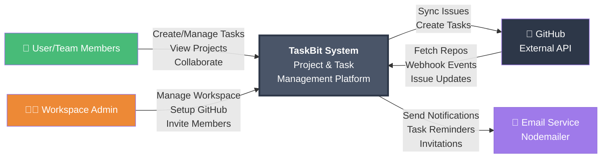
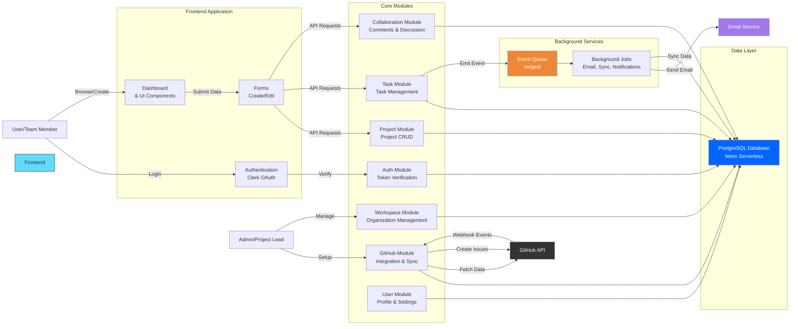
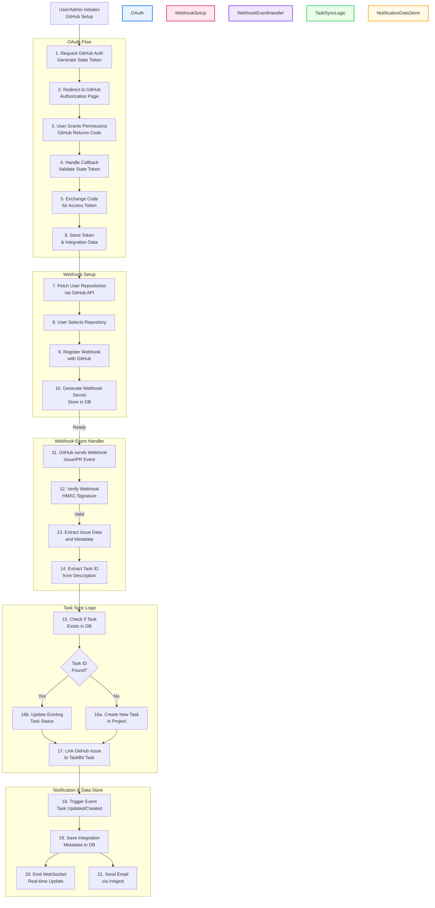

## 3. Data Flow Diagram - Level 0 (Context)

```mermaid
graph LR
    User["👤 User/Team Members"]
    GitHub["🐙 GitHub<br/>External API"]
    Email["📧 Email Service<br/>Nodemailer"]
    Admin["👨‍💼 Workspace Admin"]
    
    TaskBit["<b>TaskBit System</b><br/>Project & Task<br/>Management Platform"]
    
    User -->|Create/Manage Tasks<br/>View Projects<br/>Collaborate| TaskBit
    Admin -->|Manage Workspace<br/>Setup GitHub<br/>Invite Members| TaskBit
    GitHub -->|Fetch Repos<br/>Webhook Events<br/>Issue Updates| TaskBit
    TaskBit -->|Sync Issues<br/>Create Tasks| GitHub
    TaskBit -->|Send Notifications<br/>Task Reminders<br/>Invitations| Email
    
    style TaskBit fill:#4a5568,color:#fff,stroke:#2d3748,stroke-width:3px
    style User fill:#48bb78,color:#fff
    style Admin fill:#ed8936,color:#fff
    style GitHub fill:#2d3748,color:#fff
    style Email fill:#9f7aea,color:#fff
```

---

## 4. Data Flow Diagram - Level 1 (Functional)

```mermaid
graph LR
    User["User/Team Member"]
    Admin["Admin/Project Lead"]
    GitHubExt["GitHub API"]
    EmailSvc["Email Service"]
    
    subgraph "Frontend Application"
        Auth["Authentication<br/>Clerk OAuth"]
        Dashboard["Dashboard<br/>& UI Components"]
        Forms["Forms<br/>Create/Edit"]
    end
    
    subgraph "Core Modules"
        AuthMod["Auth Module<br/>Token Verification"]
        WorkspaceMod["Workspace Module<br/>Organization Management"]
        ProjectMod["Project Module<br/>Project CRUD"]
        TaskMod["Task Module<br/>Task Management"]
        CommentMod["Collaboration Module<br/>Comments & Discussion"]
        GitHubMod["GitHub Module<br/>Integration & Sync"]
        UserMod["User Module<br/>Profile & Settings"]
    end
    
    subgraph "Data Layer"
        Database["PostgreSQL Database<br/>Neon Serverless"]
    end
    
    subgraph "Background Services"
        Inngest["Event Queue<br/>Inngest"]
        Jobs["Background Jobs<br/>Email, Sync, Notifications"]
    end
    
    User -->|Login| Auth
    Auth -->|Verify| AuthMod
    User -->|Browse/Create| Dashboard
    Dashboard -->|Submit Data| Forms
    Forms -->|API Requests| ProjectMod
    Forms -->|API Requests| TaskMod
    Forms -->|API Requests| CommentMod
    Admin -->|Setup| GitHubMod
    Admin -->|Manage| WorkspaceMod
    
    AuthMod --> Database
    WorkspaceMod --> Database
    ProjectMod --> Database
    TaskMod --> Database
    CommentMod --> Database
    GitHubMod --> Database
    UserMod --> Database
    
    TaskMod -->|Emit Event| Inngest
    Inngest --> Jobs
    Jobs -->|Send Email| EmailSvc
    Jobs -->|Sync Data| Database
    
    GitHubMod -->|Fetch Data| GitHubExt
    GitHubMod -->|Create Issues| GitHubExt
    GitHubExt -->|Webhook Events| GitHubMod
    
    style Frontend fill:#61dafb,stroke:#333
    style Database fill:#0066ff,color:#fff
    style GitHubExt fill:#333,color:#fff
    style EmailSvc fill:#9f7aea,color:#fff
    style Inngest fill:#ed8936,color:#fff
```

---

## 5. Data Flow Diagram - Level 2 (Detailed: GitHub Integration + Project Management)

```mermaid
graph TD
    UserInit["User/Admin Initiates<br/>GitHub Setup"]
    
    subgraph "OAuth Flow"
        ReqAuth["1. Request GitHub Auth<br/>Generate State Token"]
        AuthPage["2. Redirect to GitHub<br/>Authorization Page"]
        UserAuth["3. User Grants Permissions<br/>GitHub Returns Code"]
        CallbackHandle["4. Handle Callback<br/>Validate State Token"]
        ExchangeToken["5. Exchange Code<br/>for Access Token"]
        StoreToken["6. Store Token<br/>& Integration Data"]
    end
    
    subgraph "Webhook Setup"
        GetRepos["7. Fetch User Repositories<br/>via GitHub API"]
        SelectRepo["8. User Selects Repository"]
        RegWebhook["9. Register Webhook<br/>with GitHub"]
        GenSecret["10. Generate Webhook Secret<br/>Store in DB"]
    end
    
    subgraph "Webhook Event Handler"
        WebhookRecv["11. GitHub sends Webhook<br/>Issue/PR Event"]
        VerifySignature["12. Verify Webhook<br/>HMAC Signature"]
        ExtractData["13. Extract Issue Data<br/>and Metadata"]
        ExtractTaskId["14. Extract Task ID<br/>from Description"]
    end
    
    subgraph "Task Sync Logic"
        CheckTask["15. Check if Task<br/>Exists in DB"]
        TaskFound{"Task ID<br/>Found?"}
        CreateNewTask["16a. Create New Task<br/>in Project"]
        UpdateTask["16b. Update Existing<br/>Task Status"]
        LinkIssue["17. Link GitHub Issue<br/>to TaskBit Task"]
    end
    
    subgraph "Notification & Data Store"
        TriggerEvent["18. Trigger Event<br/>Task Updated/Created"]
        SaveIntegration["19. Save Integration<br/>Metadata to DB"]
        NotifyUser["20. Emit WebSocket<br/>Real-time Update"]
        SendEmail["21. Send Email<br/>via Inngest"]
    end
    
    UserInit --> ReqAuth
    ReqAuth --> AuthPage
    AuthPage --> UserAuth
    UserAuth --> CallbackHandle
    CallbackHandle --> ExchangeToken
    ExchangeToken --> StoreToken
    StoreToken --> GetRepos
    GetRepos --> SelectRepo
    SelectRepo --> RegWebhook
    RegWebhook --> GenSecret
    GenSecret -->|Ready| WebhookRecv
    WebhookRecv --> VerifySignature
    VerifySignature -->|Valid| ExtractData
    ExtractData --> ExtractTaskId
    ExtractTaskId --> CheckTask
    CheckTask --> TaskFound
    TaskFound -->|Yes| UpdateTask
    TaskFound -->|No| CreateNewTask
    UpdateTask --> LinkIssue
    CreateNewTask --> LinkIssue
    LinkIssue --> TriggerEvent
    TriggerEvent --> SaveIntegration
    SaveIntegration --> NotifyUser
    SaveIntegration --> SendEmail
    
    style OAuth fill:#e6f3ff,stroke:#0066ff,stroke-width:2px
    style WebhookSetup fill:#ffe6f0,stroke:#d81b60,stroke-width:2px
    style WebhookEventHandler fill:#f0e6ff,stroke:#7c3aed,stroke-width:2px
    style TaskSyncLogic fill:#e6ffe6,stroke:#22c55e,stroke-width:2px
    style NotificationDataStore fill:#fff9e6,stroke:#f59e0b,stroke-width:2px
```
